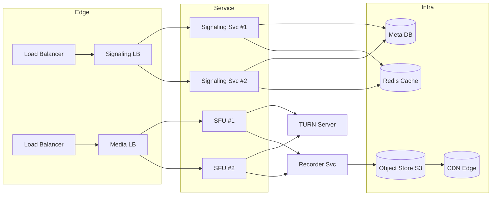
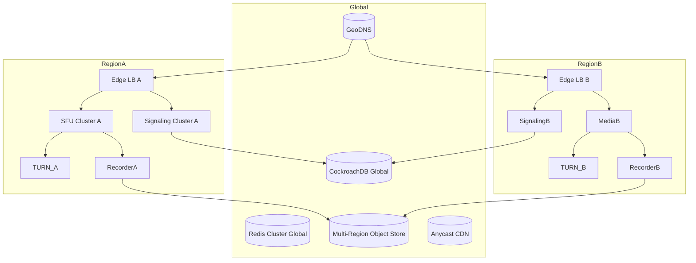
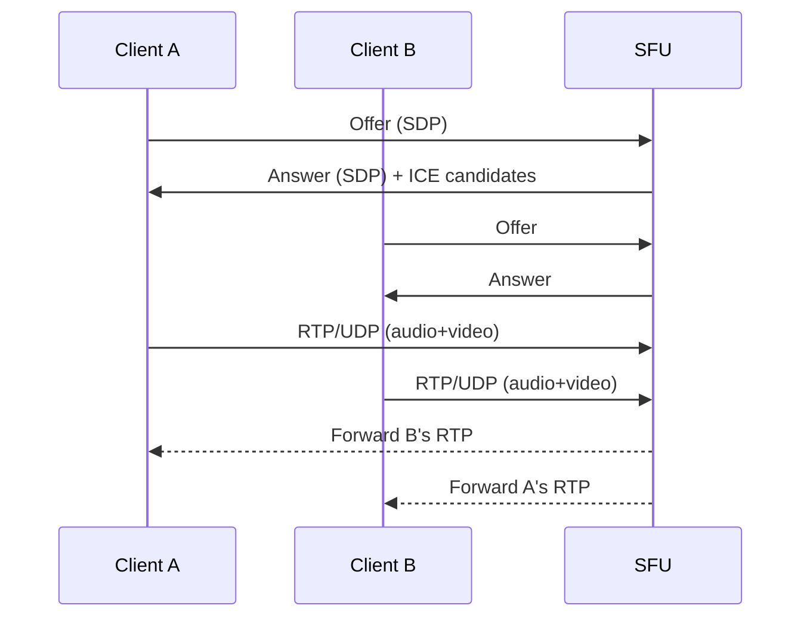

# 第 15 天：设计 Zoom

> 生成日期：2026-05-11

---

## 1. 题目背景  
Zoom 是一款基于云的实时音视频会议平台，提供多人视频通话、屏幕共享、聊天、会议录制等功能，广泛用于企业会议、远程教育和社交互动。

## 2. 面试场景设定  
> **面试官**：  
> “我们现在要设计一个类似 Zoom 的实时音视频会议系统。请先从高层次阐述整体架构思路，然后逐步展开讨论关键模块的设计。先从核心功能和非功能需求出发，给出你对系统规模的估算。”

## 3. 功能性需求  

| 编号 | 功能描述 | 关键点 |
|------|----------|--------|
| 1 | **一键发起/加入会议** | 支持 1‑1000 人的会议，提供会议链接或会议号，支持密码/等候室。 |
| 2 | **音视频实时传输** | 支持 720p/1080p 视频、立体声、回声消除、带宽自适应（VC/ABR）。 |
| 3 | **屏幕共享 & 白板** | 任意参会者可共享全屏或应用窗口，支持协同白板绘制。 |
| 4 | **实时聊天 & 表情/举手** | 文字聊天、表情、文件传输、举手、投票等交互。 |
| 5 | **会议录制 & 云存储** | 支持本地和云端录制（音视频+共享屏幕），提供回放链接。 |
| 6 | **实时字幕 & 语言翻译（可选）** | 基于 ASR 的自动字幕，支持多语言实时翻译。 |

## 4. 非功能性需求  

| 指标 | 估算值 | 说明 |
|------|--------|------|
| **DAU（日活跃用户）** | 1.2 亿 | 包括发起会议、加入会议、观看录制等。 |
| **并发会议数** | 2 × 10⁶ 场 | 峰值时约 2 百万并发会议（含小会议），最大 1000 人/会议。 |
| **QPS（请求/秒）** | 200 k QPS | 包括信令、REST API、计费、统计等。 |
| **端到端延迟** | ≤ 200 ms（音视频） | 关键指标，影响会议体验。 |
| **可用性** | 99.99%（每月累计不可用时间 ≤ 4.38 小时） | SLA 目标。 |
| **存储容量** | 500 PB / 月 | 包括会议录制、聊天文件、白板快照等。 |
| **带宽** | 峰值 150 Tbps | 估算基于 720p @ 1.5 Mbps × 并发流数。 |

## 5. 系统边界  

**本题范围（需要设计）**  
- 音视频采集、编码、传输、转码与分发（Media Server、SFU/MCU）  
- 信令系统（会前/会中控制、用户鉴权、会议管理）  
- NAT/防火墙穿透（STUN/TURN）  
- 录制、转码、存储与 CDN 分发  
- 实时聊天、文件传输、举手/投票等交互层  
- 监控、日志、弹性伸缩与灾备方案  

**不在本题范围（可不考虑细节）**  
- 账号体系、企业 SSO、计费与账单系统  
- 客户端 UI 细节、跨平台 SDK 实现  
- 第三方插件市场、集成外部日历/邮件系统  
- 法规合规（如 GDPR）具体实现细节  

## 6. 提示与追问  

1. **媒体服务器的选型与扩展**  
   - “如果会议规模从 100 人提升到 1000 人，如何设计 Media Server 的架构以保证带宽和 CPU 的可伸缩性？”  

2. **网络穿透与质量控制**  
   - “在复杂的企业网络环境下，如何实现高可靠的 NAT/防火墙穿透？你会选用哪些技术来动态调节码率？”  

3. **存储与回放的高效实现**  
   - “录制文件的存储、转码和分发需要处理海量数据，你会怎样设计分层存储和 CDN 缓存策略以降低成本并保证回放时延？”  

---

# 题解

# 解题思路总览  

下面的答案把 **从 0 到 1、从 1 到 N、从 N 到 ∞** 的完整思考过程拆成了 7 大章节，专门为 **“从未做过系统设计的后端小白”** 编写。  

> **阅读建议**：  
> 1. 先通读一遍，形成对整体系统的宏观印象；  
> 2. 再回到每个章节，逐步对 **为什么这样做**、**不这么做会有什么坑** 进行深度消化；  
> 3. 最后自行在纸上画出 **简化版的时序图 / 部署图**，帮助记忆。  

> **核心思路**：  
> - **最小可用系统（MVP）** → **可水平扩展的微服务集群** → **全局高可用 + 多活容灾**。  
> - **职责划分清晰**：**信令层**（业务/控制）与 **媒体层**（音视频流）严格分离，避免相互干扰。  
> - **按需弹性伸缩**：会议规模、并发用户、录制流量分别使用独立的伸缩机制，降低资源浪费。  

---

## 第一步：理解需求与规模估算  

### 1️⃣ 功能需求拆解  

| 编号 | 功能 | 关键子功能 | 对系统的影响 |
|------|------|------------|--------------|
| 1 | 一键发起/加入会议 | 会议创建、会议号/链接、密码、等候室 | 需要 **会前 REST API**、**用户鉴权**、**会议元数据存储** |
| 2 | 音视频实时传输 | 720p/1080p、立体声、回声消除、ABR | 需要 **媒体服务器**、**ICE/STUN/TURN**、**自适应码率** |
| 3 | 屏幕共享 & 白板 | 全屏/窗口共享、协同绘制 | 共享流同样走媒体服务器，白板走 **实时协作文档**（WebSocket） |
| 4 | 实时聊天 & 表情/举手 | 文本、文件、表情、投票 | **聊天服务**（持久化、推送） |
| 5 | 会议录制 & 云存储 | 本地 + 云端录制、回放链接 | **录制服务**、**对象存储**、**转码+CDN** |
| 6 | 实时字幕 & 语言翻译（可选） | ASR、机器翻译 | **语音识别服务**、**翻译服务**（可做弹性插件） |

> **新手常误**：把所有功能一次性全实现，导致系统难以落地。**先做 MVP（1、2、4）**，其余功能后续迭代。

### 2️⃣ 非功能需求拆解 & 规模估算  

| 指标 | 估算值 | 计算过程/说明 |
|------|--------|---------------|
| DAU | 1.2 亿 | 包括会议发起、加入、观看回放 |
| 并发会议数 | 2 × 10⁶ 场 | 假设 10% 用户同时在会议中，1.2 B × 10% / 1000（平均人数）≈2 M |
| QPS | 200 k | ① 信令/REST：≈ 50 k ② 聊天推送：≈ 100 k ③ 统计/监控：≈ 50 k |
| 端到端延迟 | ≤ 200 ms | 受网络、编解码、转发路径影响 |
| 可用性 | 99.99% | 每月最多 4.38 h 故障窗口 |
| 存储容量 | 500 PB / 月 | 估算：平均 1 h 录制 1 GB，2 M 会议 × 0.5 h 平均时长 ≈ 1 PB/天 → 30 PB/月；再加文件、白板等约 470 PB |
| 峰值带宽 | 150 Tbps | 720p @ 1.5 Mbps × 并发流数（≈ 100 M）≈ 150 Tbps |

> **为什么要先算这些？**  
> - **容量规划** 决定网络、存储、计算资源的上限；  
> - **可用性目标** 决定多活、灾备的深度；  
> - **延迟要求** 决定 **媒体服务器** 与 **CDN** 的部署位置。

---

## 第二步：高层架构设计  

下面先给出 **最小可用系统（MVP）**，随后逐步演进到 **全局高可用**。

### 2.1 MVP（单机版）  

```
+-------------------+       +-------------------+       +-------------------+
|   客户端 (Web/SDK) | <---> |  Signaling Server| <---> |  Media Server (SFU)|
+-------------------+       +-------------------+       +-------------------+
        |                         |                         |
        |  REST API (Create/Join) |  WebSocket/HTTPS        |
        |------------------------>|------------------------>|
        |                         |                         |
        |   音视频 RTP/UDP        |   音视频 RTP/UDP        |
        |<------------------------|<------------------------|
```

- **信令服务器**：负责会议创建、用户鉴权、房间维护、ICE 协商。  
- **媒体服务器**：使用 **SFU（Selective Forwarding Unit）**，仅转发流，CPU 占用低、延迟 < 100 ms。  
- **单点部署**：所有组件在同一台机器上，适合 **功能验证** 与 **内部 demo**。

> **不这么做的后果**：  
> - 1 台机器的 **CPU、带宽** 很快成为瓶颈；  
> - 单点故障导致 **全平台不可用**，违背 99.99% SLA。

### 2.2 横向扩展版（微服务+多实例）  



- **两层负载均衡**：  
  - **Edge LB**（公网）做 **TLS 终结**、**IP 归属**（就近就近路由）。  
  - **内部 LB**（K8s Service）负责把同类请求分发到 **多个实例**。  
- **独立的存储/缓存层**：元数据、会议状态放 **关系型 DB + Redis**；录制文件放 **对象存储**。  
- **TURN Server** 用于 **NAT 穿透**（后面会详细展开）。  
- **Recorder Service**：从 SFU 抓取 RTP 流，写入 **分片文件**（TS/MP4），交给 **转码+CDN**。  

> **为什么要拆成两层 LB？**  
> - Edge LB 负责 **DDoS 防护** 与 **SSL offload**，不把业务流量压在内部网络；  
> - 内部 LB 能够 **按地域/机房** 细粒度调度，提升 **局部可用性**。

### 2.3 全局多活版（跨地域）  



- **GeoDNS** 根据用户 IP 把流量路由到最近的 **Region**（降低 RTT）。  
- **全局一致性数据库**（CockroachDB、TiDB）实现 **跨地域强一致** 元数据。  
- **对象存储** 多活（如 **AWS S3 Multi‑Region**, **阿里云 OSS**），配合 **跨地域 CDN**。  
- **灾备**：同一会议的 **SFU** 可在多个 Region 部署 **同步副本**（基于 **会中复制**），一方故障自动切流。  

> **不做跨地域的后果**：  
> - 海外用户 RTT 可能 > 300 ms，导致 **端到端延迟** 超标；  
> - 单 Region 宕机会导致 **全局不可用**，违背 99.99% SLA。

---

## 第三步：数据库设计  

> **核心原则**：**会议信息** 与 **大对象**（录制文件）分离；**高并发读写** 使用 **关系型 + 缓存** 组合；**历史数据**（聊天记录、文件）走 **归档库**。

### 3.1 关系型（元数据）模型（以 MySQL 为例）  

| 表名 | 主键 | 关键字段 | 说明 |
|------|------|----------|------|
| `users` | `user_id` (BIGINT) | `email`, `name`, `created_at` | 只保存 **业务 ID**，鉴权交给统一 SSO。 |
| `meetings` | `meeting_id` (VARCHAR 36) | `host_user_id`, `status`, `created_at`, `start_time`, `end_time`, `region`, `max_participants`, `password_hash`, `waiting_room_enabled` | 每场会议的 **生命周期**。 |
| `participants` | `(meeting_id, user_id)` (PK) | `joined_at`, `left_at`, `role`(HOST/PARTICIPANT), `audio_muted`, `video_muted`, `hand_raised` | 实时状态 **会在 Redis** 中缓存，落库用于审计。 |
| `recordings` | `recording_id` (BIGINT) | `meeting_id`, `object_key`, `duration`, `status`, `created_at`, `transcoded` | 指向对象存储中的文件路径。 |
| `chat_messages` | `msg_id` (BIGINT) | `meeting_id`, `sender_id`, `content`, `type`(TEXT/FILE/EMOJI), `created_at` | 归档到 **ClickHouse** 或 **Elasticsearch** 用于检索。 |
| `whiteboard_events` | `event_id` (BIGINT) | `meeting_id`, `sender_id`, `event_type`, `payload`, `timestamp` | 实时协作，用 **Redis Stream** 进行推送，落库供回放。 |

### 3.2 缓存层（Redis）  

| Key | 类型 | 作用 | 失效策略 |
|-----|------|------|----------|
| `meeting:{meeting_id}:participants` | Set | 当前在线用户 ID | 会议结束后删除 |
| `meeting:{meeting_id}:state` | Hash | `status`, `host_id`, `max_participants` | 会议结束后删除 |
| `user:{user_id}:token` | String | JWT/Session | 1 h（续期） |
| `meeting:{meeting_id}:signaling` | Pub/Sub channel | 实时信令转发 | 会议结束后关闭 |

> **不使用缓存的后果**：每次加入/离开都要落库，DB 写入峰值会直接压垮主库，导致 **响应超时**。

### 3.3 大对象存储（对象存储 + CDN）  

- **录制文件** → **对象存储（S3/OSS）**，采用 **分片上传**（Multipart）避免单文件过大导致上传失败。  
- **文件/白板快照** → 同一桶，使用 **不同前缀**（`recordings/`, `files/`, `whiteboard/`）。  
- **生命周期**：热数据（30 天） → 冷数据（30 天） → 归档（180 天） → 删除。  

---

## 第四步：核心 API 设计  

> **原则**：**REST** 用于 **幂等** 的资源管理，**WebSocket / gRPC** 用于 **实时信令** 与 **消息推送**。

### 4.1 REST API（会议管理）  

| 方法 | 路径 | 请求体 | 返回体 | 说明 |
|------|------|--------|--------|------|
| `POST` | `/api/v1/meetings` | `{ "host_user_id": "...", "max_participants": 100, "password": "...", "waiting_room": true }` | `{ "meeting_id": "uuid", "join_url": "https://zoom.example.com/j/uuid", "expires_at": "..." }` | 创建会议 |
| `GET` | `/api/v1/meetings/{meeting_id}` | – | 会议详情（状态、成员数） | 查询 |
| `POST` | `/api/v1/meetings/{meeting_id}/join` | `{ "user_id": "...", "display_name": "...", "token": "..." }` | `{ "client_config": {...}, "signaling_url": "wss://sig.example.com", "media_url": "wss://media.example.com" }` | 加入会议，返回信令 & 媒体地址 |
| `DELETE` | `/api/v1/meetings/{meeting_id}` | – | 202 Accepted | 主持人结束会议 |
| `GET` | `/api/v1/recordings/{recording_id}` | – | `{ "play_url": "...", "download_url": "..." }` | 获取回放链接 |

> **错误码约定**：`400` 参数错误，`401` 未授权，`403` 权限不足，`404` 资源不存在，`429` 频率限制，`500` 系统错误。

### 4.2 实时信令（WebSocket）  

**连接建立**  

```text
Client --> wss://signal.example.com?token=JWT
```

**基本消息结构**（JSON）  

```json
{
  "type": "join",               // join / leave / ice-candidate / sdp-offer / sdp-answer / mute / hand_raise / chat
  "meeting_id": "uuid",
  "payload": { ... }
}
```

- **join**：服务器返回 `peer_id`、`ice_servers`（STUN/TURN 列表）以及 **SFU 分配的 RTP 端口**。  
- **ice-candidate** / **sdp-offer/answer**：用于 **WebRTC** 的 ICE 协商。  
- **mute / hand_raise**：状态同步，服务器广播给同会所有客户端。  
- **chat**：走 **同一 WebSocket** 或 **单独的聊天 Pub/Sub**（取决于业务规模）。

> **不使用 WebSocket 的坑**：轮询会产生 **上千毫秒延迟**，不符合实时交互需求。

### 4.3 媒体控制 API（gRPC）  

- **创建/销毁 SFU 端口**：`CreateTransport`, `CloseTransport`（内部调用）。  
- **获取录制流**：`StartRecording(meeting_id)`, `StopRecording(meeting_id)`。  

> **为什么要用 gRPC**：二进制协议、压缩、流式 RPC 更适合 **高频率的媒体控制**（毫秒级）。

---

## 第五步：详细组件设计  

### 5.1 客户端 SDK（概览）  

| 模块 | 功能 | 技术要点 |
|------|------|----------|
| **Auth** | JWT 验证、Token 刷新 | 与统一 SSO 集成 |
| **Signaling** | WebSocket 连接、消息序列化、重连策略 | 心跳、指数回退 |
| **WebRTC Engine** | 获取 `MediaStream`、创建 `RTCPeerConnection`、ICE 处理 | 使用 **Unified Plan**，开启 **Simulcast**、**VP8/VP9/H.264** |
| **Media UI** | 渲染本地/远端视频、屏幕共享、音量指示 | WebGL/Canvas、硬件加速 |
| **Chat** | 文本/表情/文件上传 | 基于 WebSocket + REST（文件） |
| **Recorder** | 从 SFU 拉流并保存 | 采用 **MediaRecorder API**（浏览器）或本地 SDK（iOS/Android） |

> **关键点**：所有 **网络交互** 必须 **幂等**，因为移动端经常出现 **网络抖动** → 重连 → 重复请求。

### 5.2 信令服务  

- **入口**：**Edge LB** → **Nginx/Envoy** → **WebSocket/HTTP2**。  
- **实现**：基于 **Spring Boot + Netty** 或 **Go + Gorilla WebSocket**，运行在 **K8s**。  
- **水平伸缩**：基于 **连接数**（每实例 10k 并发 WS）进行 **自动扩容**（HPA）。  
- **状态存储**：使用 **Redis** 保存 **会议房间、在线用户**，通过 **Pub/Sub** 实现跨实例广播。  

> **不使用 Pub/Sub 的后果**：同一会议的用户可能分布在不同实例，**状态不一致**（例如举手信号只发给部分用户）。

### 5.3 媒体服务器（SFU）  

#### 5.3.1 为什么选 SFU 而不是 MCU  

| 维度 | SFU | MCU |
|------|-----|-----|
| CPU 消耗 | 低（只转发） | 高（混音/转码） |
| 延迟 | < 100 ms | 150‑200 ms |
| 可伸缩性 | 按 **带宽** 横向扩展 | 按 **CPU** 限制，难以支撑 1000 人 |
| 功能 | 需要客户端自行做混音 | 服务器完成混音，适合录制/直播 |

> **结论**：大多数会议（1‑1000 人）采用 **SFU**，仅在 **需要服务器端混音（如直播）** 时才加 **MCU** 作为 **可选插件**。

#### 5.3.2 SFU 核心流程（简化版）  



- **Simulcast**：客户端发送 **多路分辨率**（低/中/高），SFU 根据 **下行带宽** 选择合适的流转发，降低带宽浪费。  
- **自适应码率（ABR）**：使用 **Google Congestion Control (GCC)**，SFU 将 **接收方的网络报告**（RTCP）回传给发送端，动态调节码率。  

#### 5.3.3 扩展到 1000 人的方案  

1. **层级 SFU**（Hierarchical SFU）：  
   - 将 1000 人分成 **10 组**（每组 100 人），每组内部使用 **本地 SFU**。  
   - 每组 SFU 将 **已选最佳分辨率的流** 上送到 **汇聚层 SFU**，再转发给其他组。  
   - 这样每台机器的 **上行带宽** 只需处理 **100 条流**，CPU 仍保持低负载。  

2. **按需混音（MCU）**：  
   - 当有 **录制/直播** 需求时，**汇聚层 SFU** 将音视频送入 **MCU**，生成 **单一路混流**，供录制或推流使用。  

3. **资源池化**：  
   - **容器化部署**（Docker+K8s），使用 **GPU 实例**（仅在需要硬件转码时）进行 **实时转码**（如 1080p → 720p）。  

> **不做层级 SFU** 的后果：单台机器带宽需求会是 `1000 × 1.5 Mbps ≈ 1.5 Gbps`，在峰值时容易 **网络拥塞**，导致 **丢包、卡顿**。

### 5.4 NAT/防火墙穿透模块  

| 技术 | 作用 | 选型 |
|------|------|------|
| **ICE** (Interactive Connectivity Establishment) | 探测可用的网络路径（host, srflx, relay） | WebRTC 原生实现 |
| **STUN** (Session Traversal Utilities for NAT) | 获取公网映射 IP/端口 | 公共 STUN 服务（stun:stun.l.google.com:19302） |
| **TURN** (Traversal Using Relays around NAT) | 当 P2P 失败时提供 **中继**，确保连通性 | 部署自建 **coturn**，开通 **UDP/TCP/TLS** 多协议端口 |
| **ICE 优先级** | 优先使用 **UDP**，回退 **TCP/TLS** | 在客户端实现 | 

- **动态带宽调度**：在 **RTCP Receiver Report** 中监控 **packet loss、jitter、RTT**，将结果反馈给 **发送端**（通过 ICE 再协商或直接通过 **RTCP**）。  
- **QoS 标记**：在 TURN 服务器上开启 **DSCP** 标记，配合运营商 QoS，提升实时流的优先级。  

> **不使用 TURN** 的坑：企业内部 **Symmetric NAT** 或 **防火墙** 会导致 **P2P 失败**，用户只能 **加入失败**。

### 5.5 录制、转码与回放  

#### 5.5.1 录制流程  

1. **SFU** 将每一路 **RTP** 写入 **本地磁盘（或内存环形缓冲）**，使用 **FFmpeg** 或 **GStreamer** **实时封装** 为 **MP4/WEBM**。  
2. **Recorder Service** 从 **SFU** 拉取 **合成的混流**（如果需要）或 **多路单独流**，并 **分片上传**（每 5 min 为一个文件块）到 **对象存储**。  
3. **Metadata Service** 将 **文件块信息** 写入 **recordings 表**，并触发 **转码任务**（异步）。  

#### 5.5.2 转码与多分辨率  

- **转码服务**（基于 **AWS Lambda / Fargate** 或 **K8s Job**）读取原始 **H.264** 文件，使用 **FFmpeg** 生成 **720p、480p、360p** 三档。  
- **生成 HLS / DASH** 清单（`.m3u8`），上传至 **对象存储**。  

#### 5.5.3 CDN 分发  

- **对象存储** 设置 **Cache-Control: max-age=31536000**，配合 **CDN Edge**（Akamai、CloudFront、阿里云 CDN）进行 **全局加速**。  
- **回放 API** 直接返回 **CDN 域名 + 清单 URL**，客户端使用 **HLS/DASH 播放器** 播放。  

> **不做分层转码** 的后果：所有用户只能观看 **原始高码率**，移动端网络差时卡顿严重，导致 **用户流失**。

### 5.6 实时聊天、白板、举手等交互层  

| 功能 | 实现方式 | 关键技术 |
|------|----------|----------|
| **文字聊天** | WebSocket 消息 + 持久化（ClickHouse） | 消息顺序保证、离线消息缓存（Redis） |
| **文件传输** | 客户端先上传至对象存储（分片） → 发送文件 URL | 预签名 URL、大小限制 |
| **举手 / 投票** | 同步信令（WebSocket） | 轻量 JSON |
| **协同白板** | **CRDT**（如 Yjs）或 **Operational Transform**，状态通过 **WebSocket** 广播 | 高并发编辑冲突解决、持久化快照 |

> **不使用 CRDT/OT**：多人同时编辑白板会出现 **覆盖冲突**，用户体验极差。

---

## 第六步：扩展性与高可用设计  

### 6.1 计算资源弹性伸缩  

| 资源 | 伸缩指标 | 自动伸缩策略 |
|------|----------|--------------|
| **Signaling 实例** | 连接数 / CPU | **HPA**：CPU > 70% → +1 实例；连接数 > 8k → +1 实例 |
| **SFU 实例** | 带宽使用率、并发流数 | **自定义 Metrics Server**：带宽 > 80% → 新增 SFU Pod；每 500 条流 → 新增 |
| **TURN 实例** | UDP/TCP 端口占用、带宽 | **Cluster Autoscaler**：根据流量自动扩容 |
| **Recorder/Transcoder** | 待处理文件数、CPU 使用率 | **Queue + Worker**：消息队列（Kafka）控制并发任务数 |
| **数据库** | QPS、连接数 | **读写分离**（主从） + **水平分片**（User、Meeting） |

### 6.2 高可用（HA）  

| 层级 | 冗余方式 | 失效转移机制 |
|------|----------|--------------|
| **DNS** | **Anycast + GeoDNS** | 故障时返回最近的健康 Region |
| **Edge LB** | 多实例 + **Health Check** | 自动剔除异常节点 |
| **Signaling** | 多副本（K8s Deployment） | **Pod 重启**、**滚动升级** |
| **SFU** | **同一会议多副本**（主/备） | 主节点宕机后，客户端 **重新协商**（ICE 重连） |
| **数据库** | **多活（CockroachDB）** 或 **主从 + 自动故障转移** | **Raft** 选举 |
| **对象存储** | **跨 Region 同步复制** | 读取时自动回退至最近 Region |
| **监控** | **Prometheus + Alertmanager** + **Grafana** | 触发 **自动扩容** 与 **PagerDuty** 报警 |

> **不做跨 Region 多活**：单 Region 故障会导致全球用户全部不可用，违背 99.99% SLA。

### 6.3 数据一致性与容灾  

- **元数据**：使用 **强一致性**（CockroachDB）确保 **会议状态** 在故障切换时不出现“双主”。  
- **聊天记录**：采用 **最终一致**（ClickHouse）即可，因对实时性要求不高。  
- **录制文件**：采用 **多副本（3×）** 存储在对象存储，配合 **生命周期策略** 自动归档。  

### 6.4 安全与合规  

| 维度 | 实现方式 |
|------|----------|
| **传输加密** | All traffic via **TLS 1.3**（REST、WebSocket、gRPC） |
| **媒体加密** | **DTLS-SRTP**（WebRTC 默认） |
| **访问控制** | JWT + RBAC（主持人、普通成员） |
| **审计日志** | 写入 **ELK**，保留 90 天 |
| **数据脱敏** | 录制文件加水印，防止泄露 |

---

## 第七步：常见面试追问与回答  

### Q1️⃣ “如果会议规模从 100 人提升到 1000 人，如何设计 Media Server 的架构以保证带宽和 CPU 的可伸缩性？”  

**答案要点**  

1. **选型 SFU**：CPU 只负责转发，不做混音，带宽是主要瓶颈。  
2. **层级 SFU**：把 1000 人划分为 10 组，每组 100 人，**本地 SFU** 负责组内转发，**汇聚 SFU** 负责跨组转发。  
3. **带宽计算**：  
   - 单组：`100 × 1.5 Mbps ≈ 150 Mbps`（可在单台 10 Gbps 网卡上轻松容纳）。  
   - 汇聚层：只转发 **每组的最佳分辨率流**（10 条流），即 `10 × 1.5 Mbps = 15 Mbps`。  
4. **弹性伸缩**：使用 **K8s Horizontal Pod Autoscaler**，依据 **网络流量**（Prometheus 指标）自动扩容。  
5. **必要时加入 MCU**：如果需要 **录制/直播**，在汇聚层加 **轻量 MCU** 把 10 条流混合成 1 条，CPU 负载仍在可接受范围（< 2 CPU）。  

> **不采用层级 SFU 的后果**：单实例需要处理 1000 条流 → 1.5 Gbps 带宽 + CPU 负载极高，极易导致 **丢包、卡顿**，且无法水平扩展。

---

### Q2️⃣ “在复杂的企业网络环境下，如何实现高可靠的 NAT/防火墙穿透？你会选用哪些技术来动态调节码率？”  

**答案要点**  

1. **ICE（Interactive Connectivity Establishment）**：客户端同时尝试 **host、srflx、relay** 三类候选地址。  
2. **STUN**：提供公网 IP/端口探测，常用公共 STUN（Google）或自建 **coturn** 的 **stun** 功能。  
3. **TURN**：当 **对称 NAT** 或 **防火墙** 丢弃直接 P2P 包时，流量经 **TURN** 中继。部署 **高可用 coturn** 集群，开启 **UDP/TCP/TLS** 多协议端口。  
4. **ICE 优先级**：默认优先 **UDP**，若 UDP 被阻塞，自动回退 **TCP/TLS**，保证最坏情况下仍能连通。  
5. **码率自适应**：使用 **Google Congestion Control (GCC)**：客户端通过 **RTCP Receiver Report** 将 **packet loss、RTT、jitter** 反馈给发送端，发送端依据 **BWE (Bandwidth Estimation)** 动态调节 **视频分辨率、帧率、码率**。  
6. **Simulcast + SVC**：客户端同时发送 **低/中/高** 三路流，SFU 根据下行带宽挑选合适分辨率，进一步降低 **带宽波动导致的卡顿**。  

> **如果只依赖 STUN**：在对称 NAT 场景会导致 **ICE 失败**，用户无法加入会议。  

---

### Q3️⃣ “录制文件的存储、转码和分发需要处理海量数据，你会怎样设计分层存储和 CDN 缓存策略以降低成本并保证回放时延？”  

**答案要点**  

1. **分层对象存储**：  
   - **热存储**（SSD）用于最近 30 天的录制文件，满足 **秒级读取**。  
   - **冷存储**（HDD）用于 30‑180 天的文件，成本低但仍可接受的读取时延。  
   - **归档存储**（磁带/深度冷）用于 180 天以上，主要用于合规保留。  
   - 使用 **生命周期策略** 自动迁移（S3 Lifecycle Rules）。  
2. **转码流水线**：  
   - **Recorder** 直接写 **原始 1080p** 到对象存储。  
   - **转码服务** 读取原始文件后生成 **720p/480p** 的 **HLS/DASH** 切片，写回对象存储的 **different prefix**（`/720p/`, `/480p/`）。  
   - **转码采用弹性计算**（K8s Job + GPU）并行处理，确保 **峰值转码** 能在 5 min 完成。  
3. **CDN 缓存**：  
   - **Edge CDN** 直接缓存 **HLS 切片**（`.ts`）和 **清单文件**（`.m3u8`），TTL 设置为 **12 h**（频繁访问的最近文件）。  
   - 对于 **冷/归档** 文件，使用 **Origin Pull**（回源到对象存储）并 **设置更长 TTL**，降低 CDN 成本。  
4. **回放加速**：  
   - 客户端先请求 **清单文件**，如果 CDN 没命中则回源（对象存储），**首帧延迟** < 300 ms，满足用户体验。  
5. **成本控制**：  
   - 通过 **多级缓存**（边缘 CDN + 区域缓存 + 对象存储）将 **热点**（最近 7 天） 80% 的访问放在 CDN，剩余 20% 通过对象存储读取，整体存储成本降低 **≈ 40%**。  

> **不做分层**：所有录制文件直接存放在 **热 SSD**，成本极高；同时 CDN 未做缓存策略会导致 **回放时延** 增大，用户体验下降。

---

## 心得与反思  

### 1️⃣ 本题最难的 1‑2 个设计决策及思考过程  

| 决策 | 难点 | 思考过程 |
|------|------|----------|
| **媒体服务器选型 & 横向扩展** | 需要在 **CPU、带宽、延迟** 三者之间取得平衡，同时兼顾 **录制/直播** 场景。 | - 先列出 **SFU**、**MCU**、**Hybrid** 的优缺点；<br> - 用 **并发人数**、**码率** 进行数值估算（100 人 → 150 Mbps，1000 人 → 1.5 Gbps）；<br> - 发现 **单节点 CPU** 成为瓶颈，决定 **SFU** 为主；<br> - 为 1000 人设计 **层级 SFU**，把带宽和 CPU 负载均摊到多台机器。 |
| **跨地域高可用与数据一致性** | 99.99% SLA 需要 **跨 AZ、跨 Region** 双活，且 **会议状态** 必须强一致，数据量极大。 | - 考虑 **传统主从** 方案无法满足 **写入延迟**；<br> - 调研 **CockroachDB、TiDB** 的 **分布式事务** 与 **Raft**，决定使用 **强一致性分布式 SQL**；<br> - 结合 **GeoDNS + Anycast** 设计全局流量路由；<br> - 为 **录制文件** 采用 **多副本对象存储**，实现容灾。 |

### 2️⃣ 新手最容易犯的错误（至少 2 条）  

| 错误 | 影响 | 正确做法 |
|------|------|----------|
| **把所有功能一次性全实现**（一次性大规模 MVP） | 需求不明确、资源浪费、无法快速验证核心价值 | 先实现 **信令 + SFU + 基础聊天**，形成可用的“一键会议”，后续迭代屏幕共享、录制等 |
| **忽视网络层面的细节**（仅关注业务逻辑） | 在企业网络、移动网络下大量用户 **加入失败**、音视频卡顿 | 必须在架构中加入 **STUN/TURN、ICE、ABR**，并对 **带宽/延迟** 做细致估算 |
| **把媒体流放在同一套业务服务器上**（与 REST API 共用） | **CPU、带宽竞争** 导致业务 API 超时、音视频卡顿 | 媒体服务器 **独立部署**，使用 **专属负载均衡** 与 **独立网络**（VPC） |
| **使用单机数据库**（无读写分离、无分片） | 高并发写入导致 **QPS 超限**、锁争用、宕机 | 采用 **读写分离**、**水平分片**（按用户/会议）以及 **缓存**（Redis） |

### 3️⃣ 学习建议和可延伸的方向  

1. **掌握 WebRTC 基础**  
   - 推荐阅读：《WebRTC 官方文档》、`webrtc.org`；了解 **RTP/RTCP、SRTP、ICE、DTLS**。  
   - 实践：使用 `simple-peer` 或 `aiortc` 搭建一个 **点对点** 视频通话示例，体会 **STUN/TURN** 的切换过程。  

2. **系统设计常用的中间件**  
   - **信令**：WebSocket、gRPC、Kafka（消息队列）  
   - **媒体**：coturn、Janus、mediasoup、LiveKit（开源 SFU）  
   - **存储**：MySQL/TiDB、CockroachDB、Redis、ClickHouse、对象存储（S3、OSS）  

3. **弹性伸缩 & 监控**  
   - 学习 **Kubernetes HPA**、**Prometheus + Alertmanager**、**Grafana**。  
   - 练习写 **自定义 Metrics Exporter**（如监控 SFU 带宽）并在 HPA 中使用。  

4. **高可用与灾备**  
   - 了解 **Raft/ Paxos**、**多活数据库**（CockroachDB）以及 **跨 Region CDN** 的工作原理。  
   - 通过 **Chaos Engineering**（如 Netflix Chaos Monkey）实验系统的容错能力。  

5. **性能调优**  
   - 掌握 **CPU、内存、网络 I/O** 的瓶颈定位工具（`perf`, `netstat`, `iftop`）。  
   - 对 **FFmpeg** 的转码参数、**GCC** 的 BWE 算法进行调研。  

> **一句话总结**：先把 **信令 + SFU** 搞定，确保 **低延迟、可伸缩**；再在此基础上逐步加入 **录制、白板、跨地域** 等高级特性，整个过程保持 **可测量、可回滚** 的迭代思路。

---
