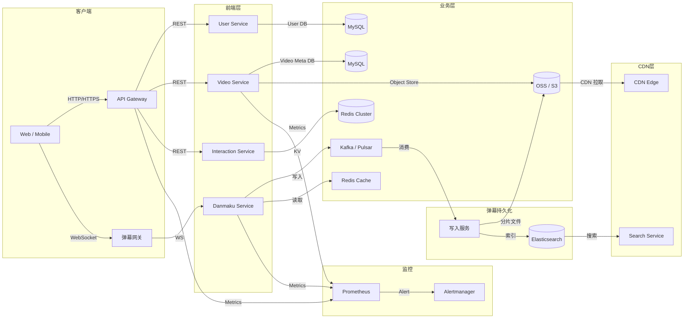

# 第 20 天：设计 Bilibili

> 生成日期：2026-05-06

---

# 系统设计面试题 – Bilibili 视频弹幕平台

## 1. 题目背景
Bilibili 是国内领先的弹幕视频社区，用户可以上传、观看、弹幕评论以及进行互动。平台主要面向二次元、游戏、科技等年轻人群体，提供 **弹幕、直播、番剧、UGC** 等多种内容形态。

## 2. 面试场景设定
> **面试官**：  
> “我们现在想从零开始设计一个类似 Bilibili 的弹幕视频平台，请你从架构层面设计核心系统，重点考虑高并发下的 **视频播放 + 弹幕实时交互** 能力。请先阐述整体思路，然后我们再逐步深入细节。”

## 3. 功能性需求
| 编号 | 功能描述 |
|------|----------|
| 1 | **用户上传视频**：支持分片上传、转码、封面生成，上传后进入审核流程。 |
| 2 | **视频点播**：用户可以按照分类、关键词搜索并点播视频，支持多分辨率自适应播放。 |
| 3 | **弹幕实时发送/展示**：观看视频时，用户可以发送弹幕，弹幕需在毫秒级延迟下同步展示给所有观看者。 |
| 4 | **弹幕过滤与管理**：提供弹幕过滤（关键词、频率、用户黑名单）以及管理员审核/删除功能。 |
| 5 | **用户互动**：点赞、投币、收藏、关注UP主，生成推荐列表。 |
| 6 | **内容分发与缓存**：基于 CDN 实现视频和弹幕的全球加速分发，支持热点视频的热点缓存。 |

## 4. 非功能性需求（关键指标估算）

| 指标 | 目标值 | 说明 |
|------|--------|------|
| **日活跃用户 (DAU)** | 5,000,000 | 目标覆盖全国二次元/年轻人主力用户群。 |
| **峰值 QPS（视频播放请求）** | 150,000 QPS | 高峰时段（晚上 20:00‑22:00）并发播放请求。 |
| **弹幕 QPS** | 80,000 QPS | 每条弹幕视为一次写入+一次读取请求。 |
| **端到端延迟** | ≤ 200 ms（弹幕显示）<br>≤ 500 ms（视频首帧） | 确保弹幕实时感和播放流畅。 |
| **可用性** | 99.9%（年均） | 包括视频点播、弹幕发送、搜索等核心功能。 |
| **存储容量** | 约 30 PB（视频原始+转码文件）<br>≈ 5 PB（弹幕持久化） | 依据 5M DAU、平均每日上传 2 GB、弹幕 100 MB/视频 估算。 |

## 5. 系统边界
**本题范围内**（需要设计的部分）  
- 视频上传、转码、存储与分发  
- 视频点播的流媒体服务（包括分段下载、ABR）  
- 弹幕的实时写入、存储、分发与过滤  
- 用户交互（点赞、收藏等）及其对推荐的影响（简要说明）  
- 基础的监控、日志与容错机制  

**不考虑的功能**（可在回答时说明不在本题讨论范围）  
- 直播推流与观看（另建直播系统）  
- 付费会员、会员专属功能  
- 复杂的推荐算法（只需提供数据流向）  
- 内容审核的机器学习模型细节（只需提供调用接口）  
- 第三方登录、OAuth 等身份认证细节（假设已有统一认证中心）  

## 6. 提示与追问
1. **弹幕高并发写入的瓶颈**  
   - “如果弹幕写入峰值达到 80 k QPS，如何设计弹幕的持久化与快速读取？有哪些降压手段可以使用？”

2. **视频分发的缓存层设计**  
   - “针对热点视频，你会如何在 CDN 与边缘缓存之间做层次化缓存？如何处理缓存失效与热度更新？”

3. **故障恢复与一致性**  
   - “在弹幕服务节点宕机的情况下，如何保证弹幕不丢失且最终一致？请描述你的数据复制与恢复方案。”

---  

请根据上述需求，完整地阐述系统的 **架构图**、**技术选型**、**数据流**、**容量规划** 以及 **关键模块的实现要点**。祝你面试顺利！

---

# 题解

# Bilibili 弹幕视频平台系统设计完整解答  

> **温馨提示**：下面的内容是从 **“零到可用”** 再到 **“高可用、可扩展”** 的完整过程，专为系统设计新手编写。每一步都会说明 **为什么要这么做**，以及 **不这么做会有什么问题**，帮助你在面试时条理清晰、思路完整。

---

## ## 解题思路总览  

1. **先把需求拆解成最小可运行单元**（MVP）。  
2. **估算规模**（用户、流量、存储），据此决定技术选型的容量基准。  
3. **画出高层架构**，明确各大块（上传、转码、存储、分发、弹幕、互动、搜索、监控）的职责。  
4. **为每块挑选合适的数据库/缓存/消息队列**，并说明选型依据。  
5. **设计关键 API**（上传、播放、弹幕写入/读取），展示请求流向。  
6. **深入每个核心组件**：  
   - 视频上传、转码、分片、对象存储、CDN  
   - 弹幕写入、持久化、实时推送、过滤、查询  
   - 用户交互、推荐数据流  
7. **加入容错、扩容、监控** 让系统满足 **99.9% 可用**、**毫秒级弹幕** 的非功能需求。  
8. **准备面试追问**（弹幕写入瓶颈、缓存层、故障恢复），给出清晰的答案思路。  
9. **最后总结**：难点、常见错误、学习路线。

---

## ## 第一步：理解需求与规模估算  

| 需求 | 关键点 | 对系统的影响 |
|------|--------|--------------|
| **视频上传** | 分片、转码、封面、审核 | 需要高吞吐的对象存储、异步转码集群 |
| **点播** | 多分辨率、ABR、搜索 | CDN、缓存、检索服务 |
| **弹幕实时** | 毫秒级写入/读取、过滤、持久化 | 高 QPS 写入、低延迟广播、持久化容错 |
| **用户互动** | 点赞、投币、收藏、关注 | KV 存储、计数服务、消息推送 |
| **内容分发** | CDN、热点缓存 | 多级缓存、失效策略 |

### 1.1 业务规模（粗略）  

| 项目 | 计算方式 | 结果 |
|------|----------|------|
| **DAU** | 题目给出 5,000,000 | 5M |
| **峰值播放 QPS** | 150,000 QPS ≈ 13.5M 次/分钟 | 约 13.5M 并发播放请求 |
| **弹幕 QPS** | 80,000 QPS（写+读） | 40k 写、40k 读 |
| **每日上传视频量** | 假设 2 GB/用户/天，10% 用户上传 → 0.5M × 2 GB = 1 PB/天 | 30 PB/年（题目已给） |
| **弹幕存储** | 100 MB/视频 × 5M 视频 ≈ 5 PB | 按天/月滚动归档 |

> **为什么要算这些？**  
> 1. 决定 **网络带宽**、**对象存储容量**、**CDN 入口流量**。  
> 2. 为 **数据库容量规划**、**消息队列并发** 提供依据。  
> 3. 给面试官展示你能把业务抽象成可量化的指标，避免盲目选型。

### 1.2 关键非功能指标  

| 指标 | 目标 | 设计考量 |
|------|------|----------|
| **弹幕端到端 ≤200 ms** | 需要低延迟推送、近实时缓存 | WebSocket/QUIC、边缘节点、分片写入 |
| **视频首帧 ≤500 ms** | CDN 缓存命中率、分片大小 | 小文件分片、预热热点 |
| **可用性 99.9%** | 每年累计停机 ≤8.76 h | 多 AZ、容灾、自动故障转移 |
| **伸缩性** | 峰谷 3‑5 倍 | 弹性伸缩、无状态服务、流量拆分 |

---

## ## 第二步：高层架构设计  

下面给出 **从 0 到 1**（单机版）再到 **分布式高可用** 的演进图。我们使用 **Mermaid** 描述，面试时可以快速画在白板上。



### 2.1 组件职责（单机 MVP）  

| 组件 | 作用 | 简单实现方式 |
|------|------|--------------|
| **API Gateway** | 统一入口，做限流、鉴权、日志 | Nginx + Lua 或 Kong |
| **User Service** | 注册、登录、用户信息 | 单体 SpringBoot + MySQL |
| **Video Service** | 上传、转码、分片、播放 URL 生成 | 单体 + 本地磁盘（演示） |
| **Danmaku Service** | 弹幕写入、读取、过滤 | 单体 + Redis（缓存） + MySQL（持久） |
| **Interaction Service** | 点赞、投币、收藏 | Redis + MySQL 计数 |
| **Search Service** | 视频标题/标签搜索 | Elasticsearch 单节点 |
| **CDN** | 视频 & 弹幕文件加速 | 直接使用云厂商 CDN（演示） |

> **为什么要拆成这些服务？**  
> - **单体** 能快速交付 MVP，验证业务。  
> - **业务边界清晰**，后期容易拆分为微服务。  
> - **不拆** 直接把所有功能塞进一个进程，会导致 **资源竞争**、**部署困难**，且 **故障范围扩大**。

### 2.2 演进到分布式高可用  

1. **无状态 API 层** → 多实例、负载均衡（L4/7）。  
2. **业务服务** → 按功能拆分为独立微服务，使用 **容器（Docker）+编排（K8s）**。  
3. **数据层**：  
   - **关系型**（MySQL） → 主从复制 + 多 AZ，使用 **Vitess** / **TiDB** 做水平分片。  
   - **键值缓存**（Redis） → 主从+哨兵/Cluster，写入热点弹幕计数。  
   - **对象存储**（OSS） → 多 AZ、分块上传、版本管理。  
   - **搜索**（Elasticsearch） → 集群 + 副本。  
   - **消息队列**（Kafka） → 多分区、复制因子 ≥3，保证写入不丢失。  
4. **弹幕实时** → **WebSocket**/ **QUIC** 通过 **弹幕网关** 转发至 **Kafka**，消费后写入分片文件 + 索引。  
5. **监控/告警** → Prometheus + Grafana + Alertmanager。  
6. **日志** → ELK（Filebeat → Logstash → Elasticsearch）或 Loki。  

---

## ## 第三步：数据库设计  

### 3.1 视频元数据（关系型）  

| 表名 | 主键 | 关键字段 | 说明 |
|------|------|----------|------|
| `video` | `video_id` (UUID) | `title, description, uploader_id, status, created_at, updated_at` | 视频基本信息 |
| `video_file` | `file_id` | `video_id, resolution, bucket, object_key, size, duration, cdn_url` | 每个分辨率的文件路径 |
| `video_tag` | `video_id, tag_id` | `tag_id` | 多对多标签 |
| `video_audit` | `audit_id` | `video_id, auditor_id, result, reason, audit_time` | 审核记录 |
| `user` | `user_id` | `username, avatar, level, created_at` | 用户基础信息（已在 Auth 中） |

> **为什么使用关系型 DB？**  
> - 元数据结构化、强一致性需求（视频状态必须精准）。  
> - 支持复杂查询（JOIN、事务）用于后台管理。

### 3.2 弹幕持久化  

**思路**：弹幕是**写多读多**的时间序列数据，单条记录体积小（≈ 200B），但并发高。我们采用 **两层存储**：

1. **实时层**：**Kafka**（写入） → **Redis**（最近 5‑10 min 的弹幕缓存）  
2. **持久层**：**分片文件**（按视频+时间段）存于 **对象存储**，并在对象存储上建立 **Elasticsearch** 索引供历史查询。

#### 3.2.1 Kafka Topic 设计  

| Topic | 分区数 | 复制因子 | 备注 |
|-------|--------|----------|------|
| `danmaku_write` | 20×（根据 QPS 估算） | 3 | 每个分区对应一段时间窗口（如 5 min） |
| `danmaku_filter` | 5 | 3 | 可选，用于离线过滤、敏感词统计 |

#### 3.2.2 Redis 缓存结构  

- **Key**：`danmaku:{video_id}:{time_window}`（例如 00:00‑00:05）  
- **Value**：Sorted Set（ZSET），**score** = 弹幕出现的毫秒时间戳，**member** = 弹幕 JSON（或压缩后）  
- **TTL**：5‑10 min（自动失效），超时后由离线任务写入对象存储。

#### 3.2.3 对象存储文件格式  

- **文件名**：`{video_id}/{date}/{hour}_{minute}_{partition}.jsonl`（每行一条弹幕）  
- **压缩**：使用 **Snappy** 或 **LZ4**，读写速度快。  
- **索引**：Elasticsearch 采用 **Percolator** / **Nested** 类型，字段包括 `timestamp`, `user_id`, `content`, `mode`（滚动、顶部、底部）等。

#### 3.2.4 数据库（MySQL）辅助表  

| 表名 | 主键 | 关键字段 | 说明 |
|------|------|----------|------|
| `danmaku_meta` | `id` (auto) | `video_id, start_time, end_time, file_path, size, created_at` | 记录每段弹幕文件的元信息，供回放时定位 |

### 3.3 互动计数（Redis + MySQL）  

- **点赞/投币/收藏** 采用 **Redis Hash** 或 **Bitmap** 实时计数，定时同步到 MySQL 作持久化。  
- 防刷机制：利用 **Redis** 的 **TTL** + **滑动窗口计数**（如 5 s 内同一用户对同视频的点赞只计一次）。

---

## ## 第四步：核心 API 设计  

下面列出 **最常用的 8 条 API**，包括请求/响应示例、调用链说明。所有 API 均遵循 **RESTful**（视频、互动）或 **WebSocket**（弹幕）风格，使用 **HTTPS + JWT** 鉴权。

### 4.1 视频上传（分片）  

**POST** `/api/v1/videos/upload/init`  

```json
{
  "title": "我的第一部番剧",
  "description": "弹幕测试",
  "tags": ["二次元","游戏"],
  "fileSize": 2147483648,
  "chunkSize": 10485760   // 10 MB
}
```

**返回**  

```json
{
  "videoId": "9f3c6a2e-...",
  "uploadId": "UP123456",
  "chunkCount": 205,
  "uploadUrl": "https://oss.example.com/..."
}
```

> **调用链**：API Gateway → Video Service → OSS（预签名 URL）  
> **为什么分片**：单文件 >2 GB 易超时，分片能实现 **断点续传**、**并发上传**，提升用户体验。

### 4.2 完成上传 & 触发转码  

**POST** `/api/v1/videos/upload/complete`  

```json
{
  "videoId": "9f3c6a2e-...",
  "uploadId": "UP123456"
}
```

**返回**  

```json
{
  "status": "TRANSCODING",
  "message": "转码任务已提交"
}
```

**内部流程**  
1. Video Service 调用 **OSS** 完成合并（如果使用分片合并 API）。  
2. 发送 **消息** 到 **Transcode Queue**（Kafka） → **Transcode Worker**（FFmpeg 集群）  
3. 转码完成后写入 **video_file** 表并生成 **CDN URL**，更新 **video.status = READY**。  

### 4.3 视频播放（获取播放信息）  

**GET** `/api/v1/videos/{videoId}/playinfo`  

**返回**（ABR 多码率）  

```json
{
  "videoId": "9f3c6a2e-...",
  "title": "...",
  "duration": 3600,
  "playUrls": [
    {"resolution":"360p","url":"https://cdn.example.com/9f3c6a2e-.../360p.m3u8"},
    {"resolution":"720p","url":"https://cdn.example.com/9f3c6a2e-.../720p.m3u8"}
  ],
  "danmakuUrl":"wss://danmaku.example.com/ws"
}
```

**调用链**：API Gateway → Video Service → MySQL (video、video_file) → 返回 CDN URL（已在 CDN Edge 缓存）  

### 4.4 弹幕发送（WebSocket）  

**WS** `wss://danmaku.example.com/ws?videoId=9f3c6a2e-...&token=JWT`

**客户端发送**  

```json
{
  "type":"send",
  "payload":{
    "content":"这波真强！",
    "mode":"roll",        // roll, top, bottom
    "color":"#FF0000",
    "timestamp": 124500   // 相对视频起点的毫秒
  }
}
```

**服务器应答**  

```json
{
  "type":"ack",
  "payload":{"status":"ok","seq":12345}
}
```

**广播**（发送给同房间的其他用户）  

```json
{
  "type":"broadcast",
  "payload":{
    "content":"这波真强！",
    "mode":"roll",
    "color":"#FF0000",
    "timestamp":124500,
    "userId":"u12345",
    "seq":12345
  }
}
```

**内部处理**  

1. **弹幕网关** 收到后做 **鉴权 + 参数校验**。  
2. 写入 **Kafka `danmaku_write`**（高可靠、异步落库）。  
3. 同时写入 **Redis ZSET**（最近 5 min）用于即时读取。  
4. 消费端 **DanmakuWriter** 把分区数据落到 **OSS**（分片文件）并写 **Elasticsearch** 索引。  

### 4.5 弹幕拉取（历史回放）  

**GET** `/api/v1/danmaku/{videoId}?start=0&end=60000`  

**返回**（压缩 JSONL）  

```
{"timestamp":1234,"content":"第一条弹幕","mode":"roll","color":"#FFFFFF","userId":"u001"}
{"timestamp":5678,"content":"好玩","mode":"top","color":"#FF0000","userId":"u020"}
...
```

**实现**：  
- 若请求时间段在 **Redis 缓存窗口**（≤5 min），直接查询 ZSET。  
- 超出窗口，查询 **Elasticsearch**，返回 **OSS** 中对应的分片文件链接，客户端下载并解压。  

### 4.6 点赞（交互）  

**POST** `/api/v1/interact/like`  

```json
{
  "videoId":"9f3c6a2e-...",
  "action":"like"   // like / cancel
}
```

**内部**：API → Interaction Service → Redis `INCRBY video:like:{videoId}` → 异步写入 MySQL `video_like` 表。  

### 4.7 搜索视频  

**GET** `/api/v1/search?q=二次元&page=2&size=20`  

**返回**  

```json
{
  "total":12456,
  "items":[
    {"videoId":"...", "title":"...", "cover":"...", "duration":...},
    ...
  ]
}
```

**实现**：Search Service 调用 Elasticsearch 集群，对 `title`、`tags`、`description` 建立倒排索引。  

### 4.8 健康检查  

**GET** `/healthz` → 返回 **200 OK** + JSON 包含每个子系统的状态（Redis、MySQL、Kafka、OSS）。  

> **为什么要列出这些 API？**  
> - 面试官常问 **“请描述一次完整的播放流程”**，这套 API 能完整覆盖从 **上传 → 转码 → 播放 → 弹幕 → 交互**。  
> - 展示 **业务拆分、调用链、异步落库** 的思考过程。

---

## ## 第五步：详细组件设计  

下面逐个拆解核心模块的实现要点、技术选型、关键参数、容错方案。

### 5.1 视频上传与转码  

| 步骤 | 技术 | 关键点 | 容错/扩展 |
|------|------|--------|-----------|
| **分片上传** | 前端使用 **File.slice** + **Pre‑signed URL**（OSS） | 支持 **断点续传**、**并发 5‑10 片** | 每片大小 5‑10 MB，OSS 自动校验 MD5；失败重试 3 次 |
| **合并** | OSS **Multipart Complete** 接口 | 完成后返回 **ETag** 校验完整性 | 若合并失败，回滚分片、通知用户 |
| **转码调度** | **Kafka** `transcode_task` → **K8s Job**（FFmpeg） | 多分辨率 (360p/480p/720p/1080p) + **封面**、**截图** | 转码失败 → 重试 2 次 → 发送 **告警**；转码完成写入 MySQL、生成 CDN URL |
| **CDN 加速** | 云厂商 CDN（Akamai / 阿里云 CDN） | **缓存热点**、**边缘压缩**（gzip） | 配置 **缓存失效时间**（TTL 24h）+ **热度预热**（热点视频提前推送） |
| **安全** | 上传签名（HMAC） + 防盗链 Token | 防止未授权下载 | Token 失效时间 1 h，按 IP/Referer 校验 |

**为什么使用对象存储 + Kafka + K8s？**  
- **对象存储** 天然支持大文件、分块、跨 AZ 冗余，成本低。  
- **Kafka** 能解耦上传与转码，提供 **高吞吐、持久化**，避免上传线程阻塞。  
- **K8s Job** 可弹性伸缩，转码任务峰值时自动扩容。

### 5.2 视频点播（流媒体）  

| 子模块 | 技术 | 关键实现 |
|--------|------|----------|
| **分段 (Chunk) / HLS / DASH** | 使用 **FFmpeg** 生成 **.m3u8 + .ts**（HLS）或 **.mpd + .mp4**（DASH） | 每段 **4‑6 s**，便于 **ABR** 与 **弹幕同步** |
| **播放 URL** | CDN 域名 + 路径 `/{videoId}/{resolution}/index.m3u8` | 支持 **Range** 请求，边缘节点直接返回分段 |
| **首帧加速** | 在转码阶段预生成 **首帧快照** → **WebP** → CDN 边缘缓存 | 首帧 < 500 ms，提升用户感知 |
| **安全防盗链** | **URL Token**（HMAC + 过期时间）+ **Referer 检查** | 防止热链抓取 |
| **日志** | Nginx/Envoy Access Log → **Kafka** → **ClickHouse** | 实时统计播放量、带宽使用、错误率 |

### 5.3 弹幕实时系统  

#### 5.3.1 写入路径  

1. **WebSocket** → **弹幕网关**（Nginx + Lua 或 **Envoy**）  
2. **参数校验 + 频率限制**（同用户 1 s 只能发 5 条）  
3. **写入 Kafka `danmaku_write`**（分区 = `videoId % N`）  
4. **同步写入 Redis ZSET**（最近 5 min）  
5. **Kafka Consumer**（多实例） → **DanmakuWriter**：  
   - 归并同一时间窗口的弹幕  
   - 按 **分片**（10 s）写入 OSS（JSONL）  
   - 同时 **批量写入 ES**（用于历史搜索）  

#### 5.3.2 读取路径  

- **实时弹幕**：客户端订阅 WebSocket，服务器 **从 Redis ZSET** 拉取对应时间窗口的弹幕（score ≤ 当前播放时间），实时推送。  
- **历史弹幕**：客户端在视频 **seek** 到 10 min 以后，调用 **GET /danmaku**，后端查询 ES → 返回 OSS 分片下载链接。  

#### 5.3.3 过滤与防刷  

- **敏感词**：在 **写入前**使用 **Trie**（本地缓存）快速匹配；命中则 **标记** 为 `pending`，写入 `danmaku_pending` 表供后台审核。  
- **频率限制**：Redis **滑动窗口计数**（key: `rate:{userId}:{videoId}`）  
- **黑名单**：用户 **黑名单** 列表放在 Redis Set，写入时直接过滤。  

#### 5.3.4 容错 & 数据一致性  

| 场景 | 处理方式 |
|------|----------|
| **Kafka 消费失败** | 重试 5 次 → 死信队列 → 人工或离线补偿 |
| **Redis 故障** | 只影响实时弹幕（短暂失效），仍有 Kafka 持久化；故障恢复后使用 **批量回放** 将缺失弹幕补入缓存 |
| **对象存储写入失败** | 自动重试 3 次 → 若仍失败，记录到 **错误表**，告警并触发 **补偿任务** |
| **节点宕机** | Kafka 分区复制因子 ≥3，保证 **不丢失**；消费者采用 **消费者组**，新节点自动接管分区消费 |

### 5.4 互动系统（点赞/投币/收藏）  

- **API → Interaction Service** → **Redis**（计数） → **异步写入 MySQL**（`user_like`、`user_coin` 表）  
- **防刷**：使用 **Redis Lua 脚本** 原子判断 **最近 1 分钟** 是否已点赞，同一用户同视频只能点赞一次。  
- **推荐数据流**：每次交互写入 **Kafka `user_event`**，供离线 **Spark/Flink** 作特征抽取，喂给 **推荐模型**（不在本题范围，只说明）。  

### 5.5 搜索服务  

- **Elasticsearch** 集群（3 主 + 2 副本）  
- **同步策略**：视频创建/更新时发送 **Kafka `video_meta`**，消费者写入 ES。  
- **查询**：多字段匹配（`title^3`, `tags^2`, `description`）+ **分词**（ik_max_word）+ **高亮**返回。  

### 5.6 监控、日志、告警  

| 项目 | 工具 | 监控指标 |
|------|------|----------|
| **系统指标** | Prometheus + Node Exporter | CPU、内存、网络、磁盘 I/O |
| **业务指标** | Prometheus Exporter (自研) | QPS、RT、错误率、弹幕延迟、转码成功率 |
| **日志** | Loki + Grafana / ELK | 接入日志、错误日志、审计日志 |
| **告警** | Alertmanager | 关键阈值（CPU>80% 持续 5min、Kafka Lag>5000、转码失败率>5%） |
| **链路追踪** | OpenTelemetry + Jaeger | 请求流经每个微服务的时延分布 |

> **为什么要监控？**  
> - 高并发系统最怕 **单点瓶颈** 隐蔽出现，监控能帮助 **快速定位**。  
> - 业务 SLA（弹幕 ≤200 ms）需要 **实时告警**，否则用户体验瞬间崩溃。

---

## ## 第六步：扩展性与高可用设计  

### 6.1 弹幕写入的高并发压降手段  

| 手段 | 说明 | 适用场景 |
|------|------|----------|
| **分区 + 多副本 Kafka** | 将 `danmaku_write` 按 `videoId % N` 分区，N≥20，复制因子 3，提升并行写入吞吐 | 80k QPS 写入 |
| **本地缓存 + 批量写入** | 网关先缓冲 1 s 内的弹幕（批量）再写入 Kafka，降低网络往返次数 | 发送端网络抖动 |
| **流量削峰 (Token Bucket)** | 对单用户、单视频的弹幕速率做限流，防止刷屏导致突发流量 | 防刷、业务安全 |
| **热点视频专属分区** | 对热点视频（如 1% 热度占 30% QPS）单独分配更多分区或专用写入节点 | 热点热点 |
| **写入侧压缩** | 在写入 Kafka 前对弹幕 JSON 进行 **Snappy** 压缩，降低带宽 | 大量弹幕 |

### 6.2 视频分发的层次化缓存  

```
[用户] → Edge CDN → Regional Cache (L2) → Origin OSS
```

- **Edge CDN**（L1）  
  - 缓存 **完整的 .m3u8 + .ts**，TTL 24h，热点视频 TTL 48h。  
  - 使用 **Cache‑Key = videoId+resolution+segment**，开启 **协商缓存**（If‑None‑Match）。

- **Regional Cache (L2)**  
  - 在省/市级部署 **Varnish / Nginx**，缓存 **热点分段**（前 10 min）和 **封面/首帧**。  
  - 失效策略：**LRU + 热度阈值**（访问次数 > 10k/天 则提升 TTL）。

- **Origin OSS**  
  - 存放所有原始转码文件与弹幕分片，提供 **Range** 支持。  
  - **分片合并**：热点分段可提前 **预热**（复制到 L2）。

> **缓存失效与热度更新**  
> 1. **定时任务**（每 5 min）统计 **访问计数**（Redis ZSET）。  
> 2. 若计数突破阈值，将该视频的 **前 30 min** 分段推送至 **Regional Cache**（使用 CDN API 预热）。  
> 3. 当热点下降，自动 **降 TTL**，让 CDN 自动淘汰。

### 6.3 故障恢复与一致性  

#### 弹幕服务节点宕机  

| 步骤 | 说明 |
|------|------|
| **1. Kafka 副本** | 每个分区复制因子 3，任意节点宕机后仍有 **leader**，生产者无需感知。 |
| **2. 消费者组重新平衡** | 新加入的消费实例自动获取失效分区的 **offset**，从上一次提交的位点继续消费。 |
| **3. Redis 主从** | 使用 **Redis Sentinel** 或 **Cluster**，故障转移后读写自动切换。 |
| **4. OSS 多 AZ** | 对象自动复制到不同可用区，单 AZ 故障不影响读取。 |
| **5. 幂等写入** | 弹幕的 **唯一 seq**（由客户端生成或服务端递增）保证 **幂等**，即使消费端重复消费也不会产生重复弹幕。 |
| **6. 数据恢复** | 若出现 **短暂数据丢失**（极端网络分区），可使用 **Kafka 的消费位点回溯**（`earliest`）重新拉取并写回 Redis/OSS。 |

#### 视频服务故障  

- **多 AZ MySQL**：主从切换（GTID）+ **读写分离**。  
- **转码作业**：使用 **K8s Job**，作业完成后 **状态持久化**；若节点挂掉，K8s 会 **重新调度**。  
- **CDN 回源**：当 Edge 节点不可用时，自动回源到 **Regional Cache** 或 **OSS**。

### 6.4 扩容策略  

| 场景 | 扩容方式 |
|------|----------|
| **播放流量峰值** | **水平扩容** API Gateway + Video Service 实例（K8s HPA） |
| **弹幕写入高峰** | 增加 **Kafka 分区**，并横向扩展 **DanmakuWriter** 消费实例 |
| **存储容量** | **对象存储** 按需扩容（几乎无限），数据库使用 **分库分表**（video_id 范围） |
| **搜索热度** | Elasticsearch **节点扩容**（增加 Data 节点），并使用 **Shard Rebalancing** |
| **监控告警** | 自动 **Scaling Alerts** 与 **PagerDuty** 触发运维 |

---

## ## 第七步：常见面试追问与回答  

### 7.1 弹幕高并发写入的瓶颈  

**问题**：如果弹幕写入峰值达到 80 k QPS，如何设计弹幕的持久化与快速读取？有哪些降压手段？

**回答结构**：

1. **写入路径拆分**  
   - **前端 → WebSocket → 弹幕网关**（轻量鉴权）  
   - **异步写入 Kafka**（高吞吐、持久化） → **消费者**落库。  
   - **同步写入 Redis ZSET**（最近 5 min）实现 **毫秒级读取**。

2. **降压手段**  
   - **分区 + 多副本**：Kafka 按 videoId%N 分区，N≥20，保证并行写入。  
   - **批量写入**：网关内部做 100 条批次写入 Kafka，减少网络往返。  
   - **热点分区**：热点视频独立分配更多分区或使用专用写入节点。  
   - **流量整形**：对单用户/单视频实施 **Token Bucket** 限流（如 5 条/秒），防止刷屏。  
   - **压缩**：写入 Kafka 前 Snappy 压缩，降低带宽。  

3. **读取路径**  
   - **实时**：从 Redis ZSET 按时间窗口 `ZRANGEBYSCORE` 拉取，延迟 < 50 ms。  
   - **历史**：超出缓存窗口查询 ES → 返回 OSS 分片链接。  

4. **容错**  
   - Kafka 复制因子 3，保证不丢失。  
   - 消费者采用 **消费者组**，节点宕机自动重新分配。  
   - Redis 主从/Cluster，故障转移不影响实时弹幕。  

### 7.2 视频分发的缓存层设计  

**问题**：针对热点视频，你会如何在 CDN 与边缘缓存之间做层次化缓存？如何处理缓存失效与热度更新？

**回答**：

1. **层次结构**  
   - **L1 – Edge CDN**：最靠近用户，缓存完整的分段文件（.ts/.m4s），TTL 24 h（热点提升至 48 h）。  
   - **L2 – 区域缓存（Regional Cache）**：省/市级 Varnish/Nginx，缓存 **热点视频的前 5‑10 min** 分段、封面、首帧。  
   - **L3 – Origin OSS**：所有转码文件与弹幕分片的原始存储。

2. **热点检测**  
   - 使用 **Redis ZSET** `video:playcount:{date}` 记录每个视频的播放次数（每分钟自增）。  
   - 每 5 min 统计一次，若 **PV > 10k** 则标记为 **热点**。

3. **预热机制**  
   - 当视频被标记为热点，调用 CDN **预热 API** 将前 10 min 的分段主动推送至 Edge。  
   - 同时将这些分段同步写入 **Regional Cache**（使用 rsync / CDN API）。

4. **失效策略**  
   - **TTL**：Edge TTL 24 h，Region TTL 12 h。  
   - **LRU + 热度阈值**：Region 缓存采用 LRU，当空间不足时优先淘汰 **非热点**（PV < 1k）。  
   - **热度下降**：如果 30 min 内 PV 连续低于阈值，自动降低 TTL，逐步让 CDN 失效。

5. **缓存一致性**  
   - 视频更新（重新转码、封面改动）时，向 CDN 发送 **Purge** 指令，清除对应路径的缓存。  
   - 弹幕不走 CDN，走专门的弹幕服务，实时性通过 Edge 推送实现。

### 7.3 故障恢复与一致性  

**问题**：在弹幕服务节点宕机的情况下，如何保证弹幕不丢失且最终一致？请描述你的数据复制与恢复方案。

**回答**：

1. **写入端保障**  
   - 客户端写入弹幕时，**WebSocket** 先写入 **Kafka**（复制因子 3），写入成功后立即 **ACK**。  
   - 即使弹幕网关宕机，只要 **Kafka** 写成功，弹幕已持久化。

2. **消费端容错**  
   - **DanmakuWriter** 以 **消费者组** 方式运行，多实例 **共享同一 group.id**。  
   - 当某实例挂掉，Kafka 自动 **重新平衡**，其他实例接管其分区的 **offset**，从上一次提交的位置继续消费。

3. **幂等性**  
   - 每条弹幕携带 **唯一 seq**（UUID + timestamp），消费者在写入 Redis/OSS 前先检查 **是否已存在**（通过 Redis Set），防止重复写入。

4. **数据复制**  
   - **Kafka**：复制因子 3 → 即使 2 台 broker 挂掉，仍有 1 台保留完整日志。  
   - **Redis**：使用 **Cluster** 或 **Sentinel**，主从同步，故障切换时间 < 5 s。  
   - **OSS**：多 AZ 冗余，自动容错。

5. **恢复流程**  
   - 节点恢复后，消费者自动 **catch‑up** 未消费的日志。  
   - 若因网络分区导致 **offset 落后**，可以使用 **Kafka 的 `seek`** 功能回溯到 `earliest`，重新拉取缺失弹幕。  
   - 对于 **Redis 缓存** 丢失的实时弹幕（仅在缓存窗口内），在消费者写入 OSS 后，**离线任务** 将缺失的弹幕重新加载到 Redis，保证后续用户仍能实时看到。

---

## ## 心得与反思  

### 1️⃣ 本题最难的设计决策  

| 决策 | 难点 | 思考过程 |
|------|------|----------|
| **弹幕的实时写入 + 持久化** | 需要兼顾 **毫秒级延迟** 与 **数据不丢失**，写入 QPS 达 80k，单点写库会成为瓶颈。 | 1. 先把需求拆成 **实时层**（Redis）+ **持久层**（Kafka → OSS）。<br>2. 评估 **Kafka** 能否承载 80k QPS（单分区 ~ 5k QPS），于是决定 **20+ 分区** 并 **多副本**。<br>3. 为防止单用户刷屏，加入 **滑动窗口限流** 与 **敏感词过滤**。<br>4. 通过 **幂等 seq** 防止消费重放产生重复弹幕。 |
| **视频热点缓存层次化** | CDN 本身已提供边缘缓存，但热点视频的 **热度波动** 快，单纯 TTL 会导致缓存命中率不稳定。 | 1. 引入 **区域缓存（L2）** 作为热点缓冲区。<br>2. 用 **Redis** 记录每分钟播放计数，定时任务做 **热度阈值** 判断。<br>3. 设计 **预热 API** 把热点分段主动推送到 Edge，避免用户首次访问的 “cold start”。<br>4. 失效时采用 **LRU+热度阈值** 自动降级，保证缓存空间被高价值内容占用。 |

### 2️⃣ 新手最容易犯的错误  

| 错误 | 解释 | 正确做法 |
|------|------|----------|
| **把所有业务塞进单体** | 单体在高并发时会出现 **CPU、内存争抢**，部署/扩容困难，故障影响全局。 | 按功能划分 **无状态微服务**，使用 **容器/K8s** 实现水平扩展。 |
| **直接把弹幕写入关系型数据库** | 每条弹幕只有几百字节，但写入事务会导致 **锁竞争**、**CPU 升压**，难以支撑 80k QPS。 | 使用 **消息队列（Kafka） + Redis 缓存** 做异步落库和实时读取。 |
| **只考虑读不考虑写的幂等性** | 消费者宕机后重新消费会产生 **重复弹幕**，影响用户体验。 | 为每条弹幕生成 **全局唯一 seq**，消费前做 **幂等校验**（Redis Set / DB 唯一索引）。 |
| **忽视 CDN 缓存失效** | 视频更新后若不主动 **Purge**，用户仍会看到旧视频，业务层面会产生纠纷。 | 在 **转码完成** 或 **封面变更** 时，调用 CDN **刷新/预热 API**。 |
| **只看 QPS 不看峰值时长** | 只准备峰值瞬时容量，忽略 **5‑10 分钟的持续高峰**，导致 **资源耗尽**。 | 根据 **峰值 + 持续时间** 计算 **并发用户数**，做好 **自动伸缩** 与 **容量预留**。 |

### 3️⃣ 学习建议与可延伸方向  

| 方向 | 推荐学习资源 | 关键点 |
|------|--------------|--------|
| **分布式消息队列** | 《Designing Data-Intensive Applications》、Kafka 官方文档 | Partition、Replication、消费位点、幂等生产 |
| **缓存系统** | 《Redis 实战》、Redis 官方教程 | ZSET、Lua 脚本、集群、哨兵 |
| **对象存储 & CDN** | 阿里云 OSS、腾讯云 COS、CDN 官方最佳实践 | 分块上传、预签名、缓存控制、预热 API |
| **流媒体协议** | HLS/DASH 规范、FFmpeg 使用手册 | 分段、ABR、加密、封装 |
| **容错与一致性** | CAP 定理、Google Spanner、Paxos/Raft | 主从复制、自动故障转移、最终一致性 |
| **监控与可观测性** | Prometheus + Grafana、OpenTelemetry | 指标、追踪、告警阈值 |
| **微服务与容器化** | 《Kubernetes 实战》、Docker 官方文档 | Service Mesh、水平伸缩、滚动升级 |
| **弹幕业务专项** | B站弹幕协议（BiliBili Danmaku Protocol）源码、开源弹幕系统如 `danmu-pool` | 消息压缩、弹幕过滤、时序存储 |

> **学习路线**：  
> 1️⃣ 先掌握 **网络、HTTP、REST** 基础。  
> 2️⃣ 学会 **单机缓存、关系型/NoSQL** 的使用场景。  
> 3️⃣ 再逐步学习 **Kafka、Redis 集群、对象存储**，实现 **高并发写入**。  
> 4️⃣ 最后把这些块拼接成 **完整的弹幕视频平台**，并练习 **画系统架构图**、**写容量预估**、**故障恢复** 的方案。

---

### 🎉 小结  

本答案从 **需求拆解 → 容量预估 → 高层架构 → 数据库设计 → API 设计 → 核心组件实现 → 高可用扩展 → 面试追问**，一步步递进，帮助你在面试现场能够 **结构化、条理清晰** 地回答。记住：

1. **先把需求转化为业务流**，再决定系统边界。  
2. **每一个关键技术（Kafka、Redis、CDN、OSS）都有明确的选型理由**，不能盲目堆砌。  
3. **高并发的瓶颈一定要拆分**（写入/读取/缓存/异步），并做好 **降压、限流、分区**。  
4. **容错与监控是必不可少的**，否则再好的设计也会在故障时崩溃。  

祝你在面试中能够 **从容阐述**、**深入细节**，拿到理想的岗位！ 🚀  
