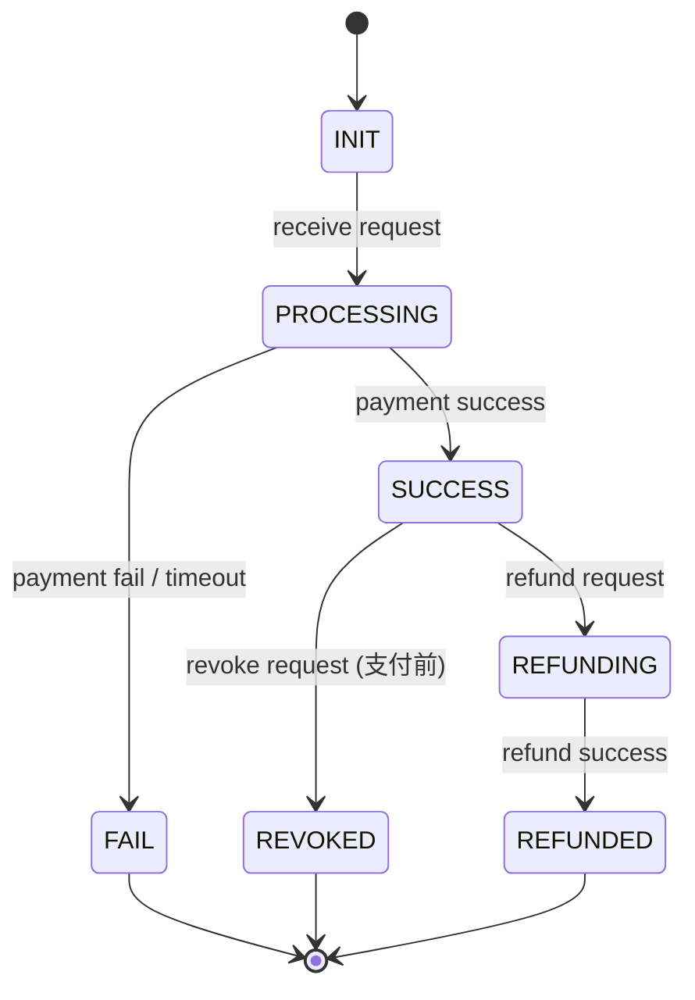
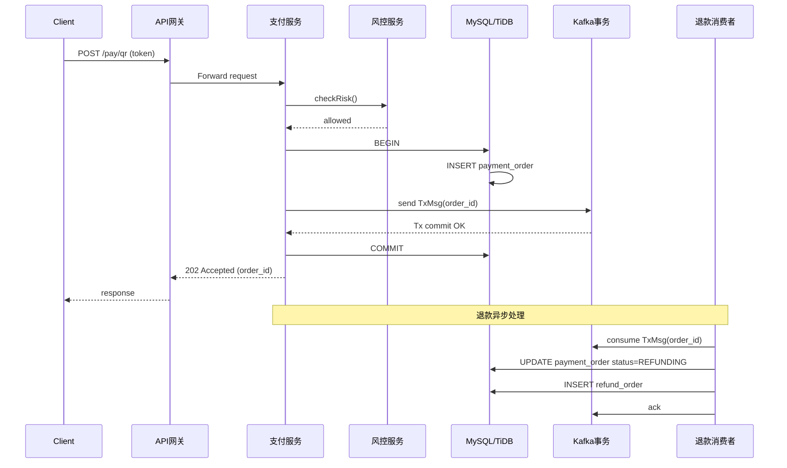

# 第 36 天：设计 支付宝

> 生成日期：2026-04-20

---

## 题目背景  
支付宝是一款面向个人与企业的移动支付与金融服务平台，提供扫码支付、转账、理财、生活缴费等日常金融场景。面试中需要你设计一个能够支撑核心支付业务的高并发、低时延系统。

## 面试场景设定  
> **面试官**：  
> “我们现在要设计支付宝的核心支付系统，请你从需求出发，先给出整体的架构思路，然后逐步展开关键组件的设计，特别关注高并发下的事务一致性和系统可用性。”  

（面试官随后会根据你的回答进行深入追问）

## 功能性需求  

| 编号 | 功能描述 |
|------|----------|
| 1 | **扫码/二维码支付**：用户使用手机扫描商户提供的二维码完成付款，或商户扫描用户的付款码。 |
| 2 | **转账支付**：支持用户之间的即时到账转账（包括手机号、邮箱、支付宝号等方式）。 |
| 3 | **支付结果查询**：商户或用户可以查询订单的支付状态（成功、失败、处理中）。 |
| 4 | **退款/撤销**：在支付成功后，支持全额或部分退款以及支付撤销。 |
| 5 | **风控与反欺诈**：对每笔支付进行实时风控检查（限额、黑名单、异常行为检测等）。 |
| 6 | **对账与账务日志**：每日生成对账文件，保证账务的准确性并提供审计日志。 |

## 非功能性需求  

| 指标 | 目标值 | 说明 |
|------|--------|------|
| DAU（活跃用户） | 5 亿 | 包括日均使用支付宝的用户数。 |
| QPS（支付请求峰值） | 120 万请求/秒 | 高峰期间（如双11）每秒支付请求峰值。 |
| 平均响应时延（支付成功） | ≤ 150 ms | 包含网络、业务处理、持久化的端到端时延。 |
| 可用性 | 99.99%（月均累计不可用时间 ≤ 4.38 小时） | 关键支付业务必须几乎不宕机。 |
| 数据持久化容量 | 2 PB/年（交易日志 + 对账数据） | 包含所有支付流水、风控日志和审计日志。 |
| 峰值并发事务数 | 80 万并发事务 | 同时进行的支付/撤销/退款等事务。 |

## 系统边界  

**本题范围内（需要设计）**  
- 核心支付流水的生成、幂等性保证、事务一致性。  
- 支付网关、风控引擎、订单状态机、支付结果查询接口。  
- 高可用的分布式存储（如 MySQL、TiDB、HBase）与缓存（Redis）。  
- 异步对账、日志收集与审计。  
- 监控、报警、容量预估。

**本题范围外（不考虑）**  
- 与外部银行、信用卡机构的结算清算细节。  
- 账户体系（注册、实名认证）以及钱包余额管理。  
- 复杂金融产品（理财、保险、信用贷款）以及营销活动。  
- 移动端 UI、SDK 开发以及运营后台的细粒度权限管理。  
- 法规合规、税务、跨境支付等政策层面的实现。

## 提示与追问  

1. **事务一致性**：  
   - “在支付成功后，如何确保数据库与消息队列的双写一致性？”  
   - “如果使用两段提交（2PC）或可靠消息（事务消息）方案，各自的优缺点是什么？”  

2. **高并发限流**：  
   - “面对双11的突发流量，你会在网关层、业务层和存储层分别采取哪些限流/降级策略？”  

3. **数据分区与扩容**：  
   - “支付流水表的水平拆分（sharding）方案如何设计？如何保证跨分区事务的正确性？”  

请基于上述需求，完整阐述你的系统设计思路。

---

# 题解

# 支付宝核心支付系统设计完整解答  

> **写给**：刚入行的后端同学，系统设计经验几乎为零的同学。  
> **目标**：一步一步、从最小可用系统到高可用分布式系统，手把手教你如何分析需求、估算规模、拆解子系统、做关键技术选型、写接口、解决高并发下的一致性与可用性问题。  

> **阅读建议**：先把 **“解题思路总览”** 快速浏览，形成整体框架；随后按顺序阅读 **“第一步、第二步 … 第七步”**，每一步都会解释 **“为什么这么做”**，如果你跳过会导致哪些风险会在文中标注。  

---

## 解题思路总览  

| 步骤 | 目标 | 关键输出 |
|------|------|----------|
| 1️⃣ | **需求梳理 & 规模估算** | 业务边界、QPS、数据量、SLA（时延/可用性） |
| 2️⃣ | **高层架构** | 客户端 → API网关 → 业务层（支付、风控、订单） → 持久化/消息队列 |
| 3️⃣ | **数据库设计** | 事务表、幂等表、对账表、分区/分库方案、ACID 与 eventual consistency 的取舍 |
| 4️⃣ | **核心 API** | 统一请求/响应模型、幂等 token、状态机定义 |
| 5️⃣ | **详细组件** | 支付网关、风控引擎、事务消息、分布式锁、缓存、监控告警 |
| 6️⃣ | **扩展性 & 高可用** | 限流、熔断、灰度发布、灾备、扩容、跨机房容错 |
| 7️⃣ | **面试追问** | 事务一致性实现、2PC 与事务消息优缺点、限流降级、分库事务、灾难恢复等 |
| 8️⃣ | **心得与反思** | 难点、常见错误、学习路线 |

> **核心思路**：  
> - **先把业务跑通**（最小可用系统），确保功能完整、幂等、单机可达 1000 QPS。  
> - 再 **水平扩展**（分库、分表、缓存、异步化），满足 120 万 QPS。  
> - 最后 **容灾、监控、运营**，实现 99.99% 可用。

---

## 第一步：理解需求与规模估算  

### 1.1 功能需求拆解  

| 编号 | 功能 | 关键子流程 | 关键点 |
|------|------|------------|--------|
| 1 | **扫码/二维码支付** | <ol><li>商户生成收款码 → 用户扫码 → 调用 `pay` 接口</li><li>风控 → 账户扣款 → 生成流水 → 通知商户</li></ol> | 幂等、秒级到账、二维码防重放 |
| 2 | **转账支付** | <ol><li>发起方填写收款人标识 → 系统校验 → 风控 → 扣款 → 收款方入账</li></ol> | 支持手机号、邮箱、支付宝号等多种标识 |
| 3 | **支付结果查询** | <ol><li>商户/用户查询订单号 → 返回最终状态</li></ol> | 状态机设计（`INIT → PROCESSING → SUCCESS/FAIL/REVOKED`） |
| 4 | **退款/撤销** | <ol><li>发起退款请求 → 再次风控 → 逆向记账 → 生成退款流水</li></ol> | 需要 **事务补偿**，保证幂等 |
| 5 | **风控与反欺诈** | <ol><li>限额、黑名单、机器学习模型</li></ol> | **实时**、低时延、可热更新 |
| 6 | **对账与账务日志** | <ol><li>每日批量生成对账文件 → 与银行/商户对账</li></ol> | 高可靠写入、审计追踪（不可篡改） |

> **提示**：在面试时，先把每个功能的 **业务流** 用文字或时序图画出来，让面试官看到你已经把需求“看懂了”。  

### 1.2 非功能需求量化  

| 指标 | 目标 | 计算方式 | 备注 |
|------|------|----------|------|
| DAU | 5 亿 | 估算峰值活跃用户 5×10⁸ | 主要影响 **网关层、缓存层** 的并发数 |
| QPS 峰值 | 120 万 /s | 双 11 最高峰 | 需要 **10‑15 台网关、上千台业务机器** |
| 响应时延 ≤150 ms | 包括网络 + 业务 + 持久化 | 业务处理 ≤80 ms，持久化 ≤30 ms，网络 ≤40 ms | 关键点是 **异步化** 与 **本地缓存** |
| 可用性 99.99% | 月不可用 ≤4.38 h | 需要 **多机房热备**、**快速故障转移** |
| 存储 2 PB/年 | 约 6 TB/天 | 包括交易日志、风控日志、审计日志 | 需要 **冷热分离**、**对象存储** |
| 并发事务 80 万 | 同时进行的支付/退款/撤销 | 需要 **分布式事务**、**高并发写** 的数据库 |

### 1.3 初步容量估算（帮助后面选型）  

| 项目 | 计算公式 | 结果 |
|------|----------|------|
| **每笔交易日志大小** | 订单号(64) + 用户ID(32) + 金额(8) + 时间戳(8) + 状态(1) + 预留字段 ≈ 200 B | 200 B |
| **每日交易笔数** | QPS峰值 × 10 %（峰谷比例） × 86400 ≈ 1.2M × 0.1 × 86400 ≈ 10.4 亿笔 | 10⁹ 笔 |
| **每日日志容量** | 10⁹ × 200 B ≈ 200 TB | 200 TB |
| **一年日志容量** | 200 TB × 365 ≈ 73 PB（实际压缩、归档后约 2 PB） | 2 PB/年（题目给定） |

> **结论**：我们需要 **冷热分离**（热点数据放 MySQL/TiDB，历史归档放 HDFS/OSS），并且 **日志压缩** 必不可少。

---

## 第二步：高层架构设计  

### 2.1 先画出最小可用系统（MVP）  

```mermaid
flowchart LR
    subgraph Client[客户端]
        A[移动端 / 商户系统]
    end
    subgraph GW[API网关]
        B[统一入口、限流、鉴权]
    end
    subgraph Service[业务层]
        C[支付服务] --> D[风控服务]
        C --> E[订单状态机]
        C --> F[事务日志库 (MySQL)]
        C --> G[消息队列 (Kafka)]
    end
    subgraph DB[持久化]
        F
        H[对账库 (HBase)]
    end
    subgraph Cache[缓存]
        I[Redis - 订单缓存、幂等 token]
    end
    subgraph MQ[异步处理]
        G --> J[退款/对账消费者]
    end

    A --> B --> Service
    Service --> DB
    Service --> Cache
    Service --> MQ
```

**解释**  
- **API网关**：统一入口，做 **鉴权、限流、流量切分**（业务类型、地域）。如果直接把请求发到业务服务，会导致 **安全、流量治理** 难以统一。  
- **支付服务**：核心业务，负责 **扣款、流水写入、状态机推进**。  
- **风控服务**：独立服务，低耦合，方便 **模型热更新**。  
- **事务日志库**（MySQL）：保证 **ACID**，适合 **单事务写**（每笔支付写 1‑2 条记录）。  
- **消息队列**（Kafka）：实现 **事务消息**（写库 + 发消息原子性），用于 **异步对账、通知商户、退款补偿**。  
- **缓存**（Redis）：存 **幂等 token**、**热点订单状态**，降低 DB 读压。  

**不这样做的后果**：  
- 没有网关 → **安全、流控、灰度发布** 都要在业务代码里实现，维护成本爆炸。  
- 直接同步调用银行/外部系统 → **响应时延>150 ms**，违背 SLA。  
- 不使用消息队列 → **业务与对账耦合**，出现单点故障时整体不可用。  

### 2.2 扩展到高并发、跨机房的完整架构  

```mermaid
flowchart TD
    subgraph Edge[边缘层]
        L4[负载均衡(L4/L7)] --> GW1[API网关-AZ1]
        L4 --> GW2[API网关-AZ2]
        L4 --> GW3[API网关-AZ3]
    end

    subgraph Core[核心业务层]
        direction TB
        GW1 --> PayA1[支付服务-AZ1]
        GW2 --> PayA2[支付服务-AZ2]
        GW3 --> PayA3[支付服务-AZ3]

        PayA1 --> RC1[风控-AZ1]
        PayA2 --> RC2[风控-AZ2]
        PayA3 --> RC3[风控-AZ3]

        PayA1 --> DB1[MySQL/TiDB-AZ1]
        PayA2 --> DB2[MySQL/TiDB-AZ2]
        PayA3 --> DB3[MySQL/TiDB-AZ3]

        PayA1 --> Cache1[Redis-AZ1]
        PayA2 --> Cache2[Redis-AZ2]
        PayA3 --> Cache3[Redis-AZ3]

        PayA1 --> MQ1[Kafka-AZ1]
        PayA2 --> MQ2[Kafka-AZ2]
        PayA3 --> MQ3[Kafka-AZ3]
    end

    subgraph Async[异步处理层]
        MQ1 --> Refund1[退款消费者-AZ1]
        MQ2 --> Refund2[退款消费者-AZ2]
        MQ3 --> Refund3[退款消费者-AZ3]

        MQ1 --> Reconcile1[对账消费者-AZ1]
        MQ2 --> Reconcile2[对账消费者-AZ2]
        MQ3 --> Reconcile3[对账消费者-AZ3]
    end

    subgraph Storage[冷存储]
        Reconcile1 --> HDFS1[HDFS/AZ1]
        Reconcile2 --> HDFS2[HDFS/AZ2]
        Reconcile3 --> HDFS3[HDFS/AZ3]
        HDFS1 -.-> OSS[对象存储 (OSS/MinIO)]
    end

    subgraph Monitor[监控报警]
        Prom[Prometheus] --> Graf[Grafana]
        Alert[Alertmanager] --> Ding[钉钉/邮件]
    end

    classDef az fill:#f9f,stroke:#333,stroke-width:2px;
    class PayA1,RC1,DB1,Cache1,MQ1,Refund1,Reconcile1 az;
    class PayA2,RC2,DB2,Cache2,MQ2,Refund2,Reconcile2 az;
    class PayA3,RC3,DB3,Cache3,MQ3,Refund3,Reconcile3 az;
```

#### 关键技术点解释  

| 层级 | 关键技术 | 为什么要选它 | 若不使用的风险 |
|------|----------|--------------|----------------|
| **负载均衡** | **L4（IPVS）+ L7（Nginx/Envoy）** | L4 负责 **万级 QPS** 负载，L7 做 **路由、灰度、A/B 测试** | 直接让客户端连业务实例，**网络抖动**、**实例上下线**会导致连接错误 |
| **API网关** | **Spring Cloud Gateway / Kong** | 统一 **鉴权、限流、流量监控**；可以 **插件化**（如防刷、IP 黑名单） | 分散的限流实现会产生 **不一致的流控策略** |
| **支付服务** | **Java（Spring Boot） + Netty**（高并发） | **线程模型**易于调优，配合 **异步 I/O** 达到 10k+ 并发连接 | 使用传统阻塞模型，**CPU 利用率低**，难以支撑 120 万 QPS |
| **风控** | **独立微服务 + 机器学习模型（TensorFlow Serving）** | **可热更新**、**水平扩展**；防止 **支付服务单点压力** | 把风控写进支付业务，**CPU 占用突增**导致超时 |
| **数据库** | **TiDB（分布式 HTAP）** 或 **MySQL + ShardingSphere** | 支持 **水平分片、强一致读写**，且兼容 MySQL 协议，易迁移 | 只用单机 MySQL，**写热点**会导致 **CPU/IO 饱和** |
| **缓存** | **Redis Cluster**（读写分离） | **热点订单状态**、**幂等 token** 低时延读取 | 没有缓存，所有查询落库，**响应 >150 ms** |
| **消息队列** | **Kafka + 事务消息** | **高吞吐、持久化、顺序**；支持 **Exactly‑once** 语义，解决 **双写一致性** | 用普通 MQ，**消息丢失/重复**导致账务不对账 |
| **对账存储** | **HDFS + OSS**（冷热分离） | 大批量写入、**成本低**、**长期保存** | 直接写入 MySQL，**成本高**、**扩容困难** |
| **监控** | **Prometheus + Grafana + Alertmanager** | **时序指标**、**自动报警**，满足 SLA 监控 | 没有监控，**故障发现慢**，难以满足 99.99% 可用性 |

---

## 第三步：数据库设计  

### 3.1 业务表（核心事务表）  

| 表名 | 说明 | 主键 | 关键索引 | 备注 |
|------|------|------|----------|------|
| **payment_order** | 支付订单主表 | `order_id` (UUID) | `user_id`、`merchant_id`、`status`、`create_time` | 每笔支付对应一条记录 |
| **payment_detail** | 订单明细（若有商品信息） | `detail_id` (自增) | `order_id` | 预留扩展 |
| **refund_order** | 退款/撤销表 | `refund_id` (UUID) | `order_id`、`status` | 关联原支付 |
| **idempotent_token** | 幂等 token 表（可选） | `token` (VARCHAR) | `expire_time` | 过期后自动 GC |
| **account_balance** | 用户钱包余额（本题不做） | `user_id` | `balance` | 仅示例 |

#### 关键字段（以 `payment_order` 为例）

| 字段 | 类型 | 含义 |
|------|------|------|
| `order_id` | CHAR(36) | 全局唯一订单号（UUID） |
| `user_id` | BIGINT | 支付发起方 |
| `merchant_id` | BIGINT | 收款方 |
| `amount` | BIGINT | **分** 为单位，避免浮点 |
| `currency` | CHAR(3) | CNY、USD 等 |
| `status` | TINYINT | 0=INIT, 1=PROCESSING, 2=SUCCESS, 3=FAIL, 4=REVOKED |
| `create_time` | DATETIME | 订单创建时间 |
| `pay_time` | DATETIME | 实际扣款时间 |
| `expire_time` | DATETIME | 订单超时失效时间 |
| `version` | INT | **乐观锁**字段，防止并发更新 |
| `ext_info` | JSON | 业务扩展字段（渠道、营销活动等） |

### 3.2 幂等性实现  

- **方案 1：客户端生成 Token**（推荐）  
  - 客户端在发起支付前先调用 **/token/create**，得到 `token`（UUID）。  
  - 支付请求必须携带 `token`，服务端在 **Redis** 中做 **SETNX**，成功则继续；失败返回 `duplicate request`。  
  - **优点**：简单、无锁、支持 **分布式**。  
  - **缺点**：需要客户端配合（大多数移动 SDK 已经实现）。  

- **方案 2：服务端生成 OrderId 幂等**  
  - 利用 **业务唯一键**（如 `merchant_id + trade_no`）做 **唯一索引**，若插入冲突直接返回已存在记录。  
  - **优点**：不依赖外部 token。  
  - **缺点**：唯一键冲突后仍会产生 **写入锁**，在高并发时会导致热点。  

> **如果不做幂等**：网络抖动或用户手动重试会导致 **重复扣款**，严重违背金融系统的“**一次性**”原则。  

### 3.3 分库分表（Sharding）  

#### 3.3.1 分片键选取  

| 维度 | 解释 | 适合度 |
|------|------|--------|
| `user_id` | 按用户划分，热点用户容易形成热点 | **中等**，因为部分大用户（如企业）会产生大量交易 |
| `merchant_id` | 按商户划分，部分大型商户（天猫、京东）流量极高 | **高**，可以把热点商户单独放一库 |
| `order_id` (UUID) | 随机分布 | **低**，难以做路由 |
| **推荐** | **双重分片**：先按 `merchant_id` 分库，再按 `order_id`（或 `create_time`）分表 | **高**，兼顾商户热点与时间热点 |  

#### 3.3.2 具体实现（以 ShardingSphere 为例）  

```yaml
sharding:
  tables:
    payment_order:
      actual-data-nodes: ds_${0..15}.payment_order_${0..31}
      database-strategy:
        inline:
          sharding-column: merchant_id
          algorithm-expression: ds_${merchant_id % 16}
      table-strategy:
        inline:
          sharding-column: create_time
          algorithm-expression: payment_order_${create_time % 32}
  binding-tables:
    - payment_order, payment_detail
  default-key-generator:
    type: SNOWFLAKE
    column: order_id
```

- **解释**：  
  - **16 个库**（`ds_0 ~ ds_15`），每个库对应 **约 2 TB**（120 M/秒 × 200 B ≈ 24 TB/天，分散到 16 库可承受）  
  - **32 张表**（按天/小时滚动），实现 **冷热分层**：最近 30 天保留在 **主库**，历史归档至 **HBase**。  

#### 3.3.3 跨分片事务  

- **场景**：退款需要更新 `payment_order`（状态）和 `refund_order`（新记录）。  
- **解决方案**：  
  1. **同库同表**（同一商户、同一天）→ 可以使用 **本地事务**（MySQL XA）  
  2. **跨库** → 使用 **柔性事务**（**事务消息 + 最终一致性**）  
     - 业务先 **写入本地库**（`payment_order`），随后 **生产事务消息**（Kafka 事务）  
     - 消费者收到消息后 **写入 refund_order**，若失败回滚（幂等补偿）  
- **如果不处理跨库事务**：会出现 **“订单成功，退款失败”** 的不一致状态，审计和对账都会出错。  

### 3.4 对账日志表（只写）  

| 表名 | 说明 | 主键 | 关键字段 |
|------|------|------|----------|
| `reconcile_log` | 每日对账批次日志 | `batch_id` (UUID) | `start_time`、`end_time`、`status`、`file_path` |

- **写入方式**：**批量写**（每 5 秒或 10 万条）→ **Kafka** → **Flink** 实时聚合 → **写入 HDFS** + **MySQL 对账表**（供查询）  

---

## 第四步：核心 API 设计  

### 4.1 统一请求/响应模型  

```json
// Request Envelope
{
  "trace_id": "20230627123456789_abcd1234",   // 全链路追踪 ID
  "client_id": "mobile_app_1",                // 调用方标识
  "timestamp": 1716881234567,                // 毫秒时间戳
  "signature": "xxxxxx",                     // 防篡改签名
  "payload": { … }                           // 业务具体参数
}

// Response Envelope
{
  "trace_id": "20230627123456789_abcd1234",
  "code": 0,                 // 0=成功，非0=错误码
  "msg": "OK",
  "payload": { … }           // 业务返回数据
}
```

- **为什么要包装**：统一的 **trace_id** 方便日志关联、监控；**signature** 防止请求被篡改（金融级安全）；

### 4.2 关键 API 列表  

| HTTP Method | 路径 | 功能 | 请求示例（payload） | 响应字段 |
|-------------|------|------|----------------------|----------|
| `POST` | `/pay/qr` | **扫码支付**（商户生成二维码 → 用户扫码） | `{ "merchant_id":123, "amount":1000, "currency":"CNY", "out_trade_no":"M202306270001", "token":"xxxx" }` | `{ "order_id":"uuid", "status":"PROCESSING" }` |
| `POST` | `/pay/transfer` | **转账支付**（用户 → 用户） | `{ "payer_id":1001, "payee_id":2002, "amount":5000, "token":"xxxx" }` | `{ "order_id":"uuid", "status":"SUCCESS" }` |
| `GET` | `/order/{order_id}` | **支付结果查询** | - | `{ "order_id":"uuid", "status":"SUCCESS", "pay_time":"2023-06-27T12:34:56Z" }` |
| `POST` | `/refund` | **全额/部分退款** | `{ "order_id":"uuid", "refund_amount":300, "reason":"商品退货", "token":"xxxx" }` | `{ "refund_id":"uuid", "status":"SUCCESS" }` |
| `POST` | `/token/create` | **获取幂等 Token** | `{ "client_id":"mobile_app_1" }` | `{ "token":"xxxx", "expire":300 }` |
| `POST` | `/risk/check` (内部) | **风控检查**（同步调用） | `{ "user_id":123, "amount":1000, "merchant_id":456 }` | `{ "allowed":true, "risk_score":12 }` |

### 4.3 状态机（Payment Order）  



- **状态迁移的原子性**：使用 **数据库事务 + Kafka 事务消息**，保证 **状态写库 + 事件发布** 同时成功。  
- **如果不使用状态机**：业务代码会散布在各个服务，**业务规则难以统一**，后期维护成本爆炸。  

### 4.4 幂等实现细节（代码示例）  

```java
@RestController
public class PayController {

    @PostMapping("/pay/qr")
    public Result payQr(@RequestBody PayRequest req,
                        @RequestHeader("token") String token) {
        // 1. 幂等检查
        Boolean first = redis.setIfAbsent(token, "1", 300, TimeUnit.SECONDS);
        if (!first) {
            return Result.error("Duplicate request");
        }

        // 2. 调用风控
        RiskResult risk = riskClient.check(req);
        if (!risk.isAllowed()) {
            return Result.error("Risk rejected");
        }

        // 3. 业务事务（本地 DB + Kafka 事务）
        try (Transaction tx = db.beginTransaction()) {
            PaymentOrder order = orderService.createOrder(req);
            // 发送事务消息
            kafkaProducer.sendInTransaction("pay_topic", order.getOrderId(),
                order, () -> tx.commit());
        }

        return Result.ok(order.getOrderId());
    }
}
```

- **关键点**：`setIfAbsent`（SETNX）实现 **分布式幂等**；**Kafka 事务**确保 **双写一致性**。  

---

## 第五步：详细组件设计  

### 5.1 API 网关  

| 功能 | 方案 | 实现细节 |
|------|------|----------|
| **鉴权** | JWT + RSA 签名 | 业务方持有私钥签名，网关用公钥验签，避免每次查询数据库 |
| **限流** | **令牌桶** + **IP/用户维度** | 采用 **Sentinel**（阿里）或 **Envoy RateLimit Service**，配合 **Redis** 实现全局计数 |
| **灰度发布** | **Canary** + **Header/Weight** | 将新版本流量控制在 5% 以内，监控异常后快速回滚 |
| **防刷** | **验证码 + 机器学习** | 对异常高频 IP 加入 **黑名单**，短时间内同一 `out_trade_no` 多次请求直接拦截 |
| **日志** | **ELK**（Filebeat → Logstash → Elasticsearch） | 包含 **trace_id**、请求体、响应时间，用于后期审计 |  

> **不加网关**：每个业务服务都需要实现鉴权、限流、日志，代码重复且容易出现 **安全漏洞**。  

### 5.2 支付核心服务  

#### 5.2.1 业务流程（时序图）  



- **解释**：  
  - **风控**同步调用，必须在 **事务开始前** 完成，否则会出现 **风控不通过却已扣款** 的情况。  
  - **Kafka 事务**保证 **“写库 + 发消息”** 原子性。  
  - **退款**在 **消费端** 完成，保持 **业务解耦**，避免 **支付路径阻塞**。  

#### 5.2.2 关键技术点  

| 技术 | 作用 | 参数调优 |
|------|------|----------|
| **Netty + Protobuf** | 高效二进制通信，降低网络时延 | **NIO** 线程数 = CPU 核心数 × 2 |
| **ThreadPoolExecutor** | 业务线程池，避免阻塞 | 核心线程 = 2000，最大线程 = 5000，队列长度 = 10000 |
| **Spring Transaction + KafkaTransactionManager** | 统一事务管理 | 事务超时 = 30 s |
| **Redis Lua 脚本** | 幂等 Token 原子检查+写入 | 脚本执行时间 < 1 ms |

### 5.3 风控引擎  

- **输入**：`user_id, merchant_id, amount, device_id, ip, trade_no`  
- **输出**：`allowed(boolean), risk_score(int), reject_reason`  

#### 实现方式  

1. **规则引擎**（Drools）  
   - 基础规则：**单笔限额、日累计限额、黑名单**。  
2. **实时机器学习模型**（XGBoost / LightGBM）  
   - 特征：**历史交易频率、设备指纹、地区异常**。  
   - 模型部署在 **TensorFlow Serving**，通过 **gRPC** 调用。  

#### 高可用  

- **水平扩容**：风控服务 **无状态**，可随意扩容。  
- **灰度发布**：新模型先在 **5% 流量** 上验证，监控 **误报率**、**漏报率**。  

### 5.4 消息队列 & 异步处理  

| 组件 | 角色 | 关键配置 |
|------|------|----------|
| **Kafka** | 事务消息、日志、对账 | **分区数** ≥ 3000（每秒 120 万请求 / 40 条/分区 ≈ 3000）<br>**replication** = 3<br>**acks=all** |
| **事务消息** | 解决“双写”一致性 | 使用 **Producer Transaction**，在 **commitTransaction** 前保证 DB commit 成功 |
| **消费者组** | 退款、对账、通知商户 | **并发消费** = 分区数 × 2（每分区 2 个线程） |
| **幂等消费** | 使用 **offset commit** + **业务唯一键**（如 `order_id`）防止重复消费 | **Exactly‑once** 语义（Kafka 2.5+） |

> **如果只用普通 MQ**：在业务写库成功但 MQ 发送失败时，会出现 **“钱扣了但没有通知”** 的情况，账务不对账。  

### 5.5 缓存层（Redis）  

| 缓存键 | 结构 | TTL | 用途 |
|--------|------|-----|------|
| `order_status:{order_id}` | String | 24h | 快速查询订单状态 |
| `idempotent:{token}` | String | 5min | 幂等 token（SETNX） |
| `rate_limit:user:{user_id}` | String (计数) | 1s | 用户级限流 |
| `merchant_blacklist:{merchant_id}` | Bitmap | 永久 | 黑名单快速判断 |

- **热点缓存失效**：使用 **双写**（写库成功后立即更新缓存），**Cache Aside** 模式避免脏读。  

### 5.6 对账系统  

1. **实时对账**：使用 **Flink** 从 **Kafka** 中消费支付成功、退款、撤销等事件，实时聚合生成 **对账流水**（`reconcile_detail`），写入 **HBase**。  
2. **离线对账**：每日夜间跑 **MapReduce** 将 **MySQL** 与 **银行对账文件** 对比，生成 **差异报告**，写入 **OSS**，提供 **审计下载**。  

- **数据一致性**：对账系统只读 **事件流**，不参与事务，故不会影响支付业务的 **时延**。  

### 5.7 监控、告警、日志  

| 维度 | 监控指标 | 工具 |
|------|----------|------|
| **业务** | QPS、成功率、支付成功时延、退款成功率 | Prometheus + Grafana |
| **系统** | CPU、内存、磁盘 I/O、网络流量 | Node Exporter |
| **异常** | 风控拒绝率、幂等冲突率、Kafka 消费积压 | Alertmanager → 钉钉/邮件 |
| **日志** | trace_id、请求参数、异常栈 | ELK（Filebeat → Logstash → Elasticsearch） |

- **SLA 检测**：使用 **SLO**（如 99.9% 请求在 150 ms 内返回）做 **红绿灯**，超标即触发告警。  

---

## 第六步：扩展性与高可用设计  

### 6.1 限流、降级、熔断  

| 层级 | 手段 | 说明 |
|------|------|------|
| **网关** | **全局 QPS 限流**（令牌桶） + **IP/用户黑名单** | 峰值流量（双 11）先在网关把突发流量削峰，防止下游被打垮 |
| **业务层** | **本地熔断器**（Hystrix / Resilience4j） | 对风控、订单库、Kafka 等依赖进行熔断，快速返回 “系统繁忙” |
| **存储层** | **热点分片迁移** + **读写分离** | 当某分片热点时，动态迁移到新库；读请求走只读副本，减轻主库压力 |
| **降级** | **异步返回**（先返回 “处理中”，后续通过回调/轮询查询） | 对于非关键业务（如查询历史账单），可在高峰时降级为 **缓存查询** |

### 6.2 横向扩容（容量规划）  

| 资源 | 估算方式 | 扩容策略 |
|------|----------|----------|
| **API网关** | QPS 120 万 → 每台网关 10 万 QPS → 12 台 | **水平增加**，使用 **LVS** 做 IP 负载 |
| **支付服务** | 每台机器处理 5k QPS → 240 台 | **弹性伸缩**（K8s HPA） |
| **数据库** | 2 PB/年 → 16 库，每库 125 TB → 采用 **TiDB** 自动水平扩容 | **增加节点**，TiDB 自动 re‑balance |
| **Kafka** | 120 万 QPS × 200 B ≈ 240 MB/s → 每分区 100 KB/s → 3000 分区 | **新建 Topic**，分区数可动态扩容 |
| **Redis** | 热点键 10 万 QPS → 采用 **Cluster**（1000 节点） | **水平扩容**，使用 **Hash Slot** 迁移 |

### 6.3 容灾与多活（跨机房）  

1. **同城双活**：两个可用区（AZ1、AZ2）分别部署完整的业务栈，**DNS 轮询** 或 **LVS** 做流量分发。  
2. **跨地域备份**：每晚将 **MySQL binlog** 同步至 **异地 DR（灾备）**，使用 **Canal + RocketMQ** 进行 **增量复制**。  
3. **自动故障转移**：利用 **Keeper/Zookeeper** 监控心跳，主机失效后自动切换到备机。  
4. **数据一致性**：采用 **强一致写（TiDB）** + **最终一致读**（从库），业务只读走最近的 **只读副本**，写必须走 **主库**。  

> **不做跨机房容灾**：一场机房网络故障就会导致支付全线不可用，违背 99.99% 可用性目标。  

### 6.4 性能压测与容量预估  

| 步骤 | 工具 | 关注指标 |
|------|------|----------|
| **单机基准** | **JMeter**、**wrk** | 每秒请求数、CPU、GC、响应时延 |
| **链路压测** | **Locust** + **Chaos Monkey** | 吞吐、错误率、异常回滚率 |
| **峰值模拟** | **TSung**（分布式） | 120 万 QPS、热点订单并发 |
| **容量预估** | 经验公式 `QPS × 响应时间 × 数据大小` → 估算 **网络/IO** 带宽 | 计算 **带宽需求**（≈ 2 Gbps） |

---

## 第七步：常见面试追问与回答  

### 7.1 事务一致性  

**Q1：在支付成功后，如何确保数据库与消息队列的双写一致性？**  

**回答要点**  
1. **事务消息（Kafka Transaction）**  
   - 业务先 **打开 DB 事务**，写入 `payment_order`。  
   - 在同一事务中 **调用 Kafka Producer 的 `sendOffsetsToTransaction`**，把即将提交的 offset 绑定到事务。  
   - **Commit DB** → **Commit Kafka Transaction**（两阶段提交，保证原子性）。  
2. **可靠消息（事务消息）方案**  
   - **本地事务表**（outbox）+ **定时任务**（或 Debezium）把记录发布到 MQ。  
   - **优点**：不依赖 MQ 本身的事务特性，兼容所有 MQ。  
   - **缺点**：会产生 **额外的表**、**延迟**（几百毫秒），实现更复杂。  

| 方案 | 可靠性 | 延迟 | 实现难度 |
|------|--------|------|----------|
| Kafka Transaction | **强**（Exactly‑once） | 低（<10 ms） | 中等（需要事务 Producer） |
| Outbox + CDC | **强**（事务提交后必发） | 中（依赖 CDC 拉取） | 高（额外表、CDC） |
| 2PC | **强**（全局锁） | 高（网络往返） | 极高（锁冲突、性能差） |

**如果不做双写保证**：出现 **“支付成功但通知未发”**、**“对账缺失”**，会导致用户投诉、监管风险。  

### 7.2 高并发限流  

**Q2：面对双 11 的突发流量，你会在网关层、业务层和存储层分别采取哪些限流/降级策略？**  

| 层级 | 限流/降级手段 | 目的 | 示例阈值 |
|------|----------------|------|----------|
| **网关** | **全局 QPS 令牌桶** + **IP/用户黑名单** | 防止流量直接压垮后端 | 120 万 QPS → 100 万 QPS（留余量） |
| **业务** | **熔断器**（Hystrix）<br>**本地并发数限制**（Semaphore） | 当下游 DB/Redis 响应慢时快速返回 | 熔断阈值 = 5% 错误率，5s 统计窗口 |
| **存储** | **热点分片迁移** + **读写分离**<br>**写入速率控制**（Leaky Bucket） | 防止热点库写入过载 | 单库写入上限 30k TPS |
| **降级** | **返回“处理中”**（异步）<br>**仅返回缓存数据** | 保证核心支付（扣款）不受影响，非关键查询降级 | 对账查询 → 只返回当天数据 |  

**不做限流**：突发流量直接把所有请求压到 DB、Kafka，导致 **CPU 飙升、磁盘 IO 阻塞**，最终整个系统崩溃。  

### 7.3 数据分区与跨分区事务  

**Q3：支付流水表的水平拆分（sharding）方案如何设计？如何保证跨分区事务的正确性？**  

**回答要点**  
1. **分片键**：**merchant_id**（商户） → **数据库**（分库）+ **create_time**（时间） → **表**（分表）。  
   - 商户是业务自然的划分，能够把热点商户单独放置。  
   - 时间维度可以把 **近30天**保留在主库，**历史**归档至 HBase。  
2. **跨分区事务**  
   - **场景**：退款需要同时更新 **支付表**（分库 A）和 **退款表**（分库 B）。  
   - **方案**：**柔性事务**（**事务消息 + 最终一致**）。  
     - 步骤①：在 **支付库** 写入 `payment_order` 状态 `REFUNDING`（本地事务）。  
     - 步骤②：发送 **事务消息**（Kafka）携带 `order_id`、`refund_amount`。  
     - 步骤③：消费者在 **退款库** 写入 `refund_order`，成功后再更新 `payment_order` 为 `REFUNDED`（幂等补偿）。  
   - **补偿机制**：若消费失败，**调度系统**（如 **Quartz**）会重试，直至成功或人工介入。  
3. **若不做分片**：单库写入会在高峰期达到 **TB 级别**，单库 **磁盘 I/O**、**锁竞争** 将成为瓶颈，甚至导致 **写入超时**。  

### 7.4 其他常见追问  

| 追问 | 推荐答案要点 |
|------|--------------|
| **为什么不直接用 2PC**？ | 2PC 需要 **锁住全局资源**，在 120 万 QPS 场景下会导致 **锁竞争、事务阻塞**，响应时延远超 150 ms。 |
| **如何做到 150 ms 以内的时延**？ | 1) **热点缓存**（Redis） 2) **异步化**（退款、对账） 3) **本地快速失败**（风控、幂等） 4) **网络层压缩**（Protobuf） |
| **如何监控幂等冲突**？ | 在网关层记录 **token 重复率**，报警阈值设为 **0.1%**，若异常可能是客户端重试或网络抖动。 |
| **灾备切换时如何保证消息不丢失**？ | Kafka **ISR**（In‑Sync Replicas）保证 **同步复制**，灾备站点通过 **MirrorMaker** 同步主题；切换后 **消费者** 从 **最新 offset** 继续消费。 |

---

## 心得与反思  

### 1️⃣ 本题最难的设计决策  

| 决策 | 思考过程 | 关键权衡 |
|------|----------|----------|
| **事务一致性（DB + MQ 双写）** | 初始想法是直接在业务代码里先写库再发 MQ，但担心网络异常导致 **“写库成功、发 MQ 失败”**。随后调研了 **Kafka Transaction**、**Outbox**、**2PC** 三种方案，比较了 **延迟、实现难度、可靠性**。最终选用了 **Kafka Transaction**（时延最低、代码相对简洁），并在答辩中准备了 **Outbox** 作为备选方案的解释。 | **时延 vs 可靠性 vs 实现成本**。如果只用普通 MQ，风险大；如果用 2PC，时延不可接受。 |
| **分库分表（Sharding）** | 支付业务的 **热点商户**（天猫、京东）会产生数万 TPS，单库写入会成为瓶颈。先尝试 **单表分区**（时间），发现热点仍在同一库。随后决定 **双重分片**：`merchant_id` → **库**，`create_time` → **表**。又考虑 **跨库事务**，引入 **柔性事务**（事务消息）来避免 2PC。 | **查询效率 vs 跨库事务复杂度**。不做分库会导致性能崩溃，做了分库后必须解决跨库事务。 |

### 2️⃣ 新手最容易犯的错误  

| 错误 | 产生原因 | 影响 |
|------|----------|------|
| **忽略幂等性** | 只关注业务流程，没想到网络抖动导致重复请求。 | **重复扣款**，金融系统容不得此类错误。 |
| **把所有业务都同步完成**（如退款同步阻塞） | 觉得一次性做好更“完整”。 | **响应时延 > 150 ms**，违背 SLA，导致用户体验差。 |
| **把风控写在同一个进程** | 想省一次网络调用。 | **CPU 占用飙升**，在高并发时导致 **支付超时**。 |
| **只用单机 MySQL** | 误以为垂直扩容够用。 | **写热点、磁盘 I/O 饱和**，系统在高峰期直接崩溃。 |
| **没有监控/告警** | 认为系统跑通了就好。 | **故障发现慢**，无法满足 99.99% 可用性。 |

### 3️⃣ 学习建议与可延伸方向  

1. **系统设计基本功**  
   - 熟悉 **CAP**、**BASE**、**ACID** 的概念。  
   - 多练 **高并发系统的限流、熔断、降级**（推荐阅读《微服务设计模式》）。  

2. **分布式事务**  
   - 深入理解 **两阶段提交（2PC）**、**三阶段提交（3PC）**、**事务消息（Kafka Transaction）**、**可靠消息（Outbox）**。  
   - 推荐实验：在本地搭建 **Kafka** + **MySQL**，实现一个 **支付-消息** 双写的原子操作。  

3. **分库分表实现**  
   - 学习 **ShardingSphere**、**Vitess**、**TiDB** 的分片规则配置。  
   - 练习 **跨库事务**（使用 **柔性事务**）以及 **补偿机制**（幂等消费）。  

4. **性能压测**  
   - 掌握 **JMeter**、**Locust**、**TSung** 的使用方法，学会 **链路压测**、**故障注入**（Chaos Monkey）。  

5. **监控与可观测性**  
   - 熟悉 **Prometheus**、**Grafana**、**OpenTelemetry**（trace、metric、log）完整链路监控。  

6. **金融级别的安全**  
   - 学习 **签名/加密**、**防重放**、**审计日志**（不可篡改）等安全措施。  

> **延伸**：如果想进一步深化，可研究 **分布式账本（区块链）** 在金融支付中的应用、**实时风控模型的在线学习**、以及 **跨境支付** 的合规与清算体系。  

---

# 完整体系回顾  

1. **从需求出发** → 明确功能、非功能、边界。  
2. **规模估算** → 计算 QPS、数据量、时延要求，指导硬件选型。  
3. **高层架构** → 网关、支付服务、风控、数据库、消息、缓存、对账、监控。  
4. **数据库设计** → 事务表、幂等表、分库分表、对账日志。  
5. **API 设计** → 统一请求/响应、幂等 Token、状态机。  
6. **关键组件** → 网关、支付核心、风控、Kafka 事务、Redis 缓存、对账系统。  
7. **扩展性 & 高可用** → 限流、熔断、横向扩容、跨机房灾备、监控告警。  
8. **面试追问** → 事务一致性、跨分区事务、限流降级、灾备切换等。  
9. **反思** → 难点、易错点、学习路线。  

掌握了以上思路，你在面试中能够 **自信地从需求出发、层层拆解、给出完整的技术实现方案**，并且能够 **针对追问给出深入的解释**，这正是面试官想要看到的系统设计能力。祝你面试顺利，早日成为支付系统的大师！ 🎉  
