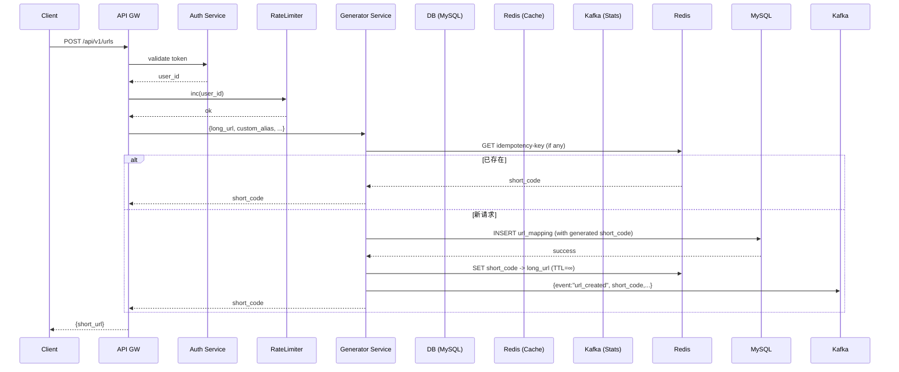
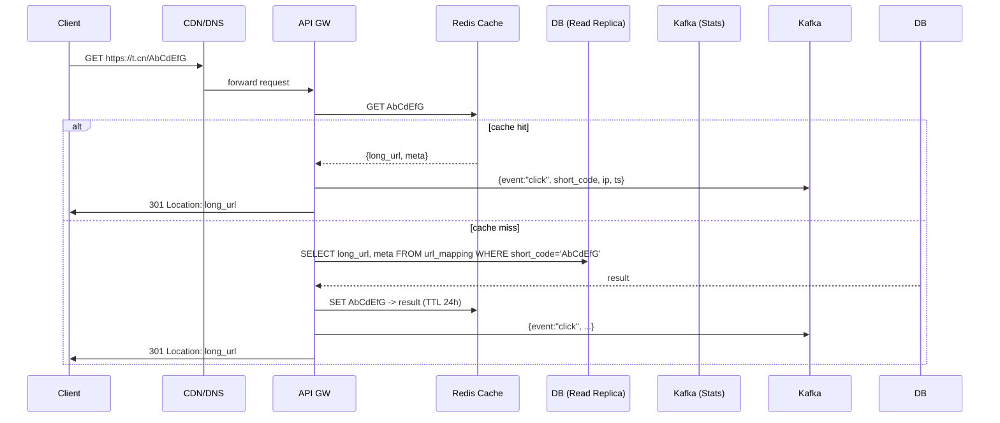

# 第 63 天：设计 短链接服务（TinyURL）

> 生成日期：2026-03-24

---

# 短链接服务（TinyURL）系统设计面试题

## 1. 题目背景
短链接服务（如 TinyURL、bit.ly）可以把一段冗长的 URL 通过编码压缩成 6~8 位的短字符串，便于在社交媒体、短信、邮件等场景中分享。用户访问短链接后，系统会将其 301/302 重定向到原始的长 URL。

## 2. 面试场景设定
> **面试官**：  
> “我们现在要设计一个全公司通用的短链接系统，要求能够支持大规模的访问和高可用。请先从需求出发，帮我梳理核心功能，然后逐步展开系统的整体架构设计。我们会在过程中针对热点细节进行追问。”

## 3. 功能性需求
- **生成短链接**：用户提交长 URL，系统返回唯一的、可自定义（可选别名）的短链接。
- **短链接解析**：用户访问短链接时，系统快速定位对应的长 URL 并完成 301/302 重定向。
- **统计与分析**：提供每个短链接的访问次数、来源 IP、时间分布等基础报表。
- **链接管理**：用户可以查询、编辑（修改别名、失效）或删除自己创建的短链接。
- **安全防护**：对恶意/钓鱼链接进行检测并阻止生成；对高频访问的短链接进行限流。
- **链接失效与有效期**：支持设置自定义的失效时间或访问次数上限。

## 4. 非功能性需求（估算数值）
| 指标 | 目标值 | 说明 |
|------|--------|------|
| **日活跃用户 (DAU)** | 1500 万 | 包括内部员工、合作伙伴以及外部普通用户 |
| **QPS（查询请求）** | 20,000 QPS 峰值 | 主要是短链接的解析请求，峰值出现在上午 9 点至 11 点以及晚上 7 点至 9 点 |
| **写入 QPS** | 2,000 QPS 峰值 | 短链接创建、编辑、删除等写操作 |
| **单次请求延迟** | ≤ 50 ms (99th percentile) | 包括网络往返 + 服务端处理 |
| **可用性** | 99.99% 年可用率 | 计划使用多可用区部署，支持自动故障切换 |
| **存储规模** | 约 5 PB | 预计累计生成 5 亿条短链接，每条记录约 10 KB（包括元数据、统计信息、审计日志） |
| **一致性要求** | 最终一致 | 统计数据可接受延迟 1~5 分钟；短链接创建后需强一致保证立即可用 |
| **安全合规** | 符合 GDPR / 国内网络安全法 | 需对用户数据加密、审计日志保留 180 天 |

## 5. 系统边界
**本题需要考虑的范围**
- 短链接的生成、解析、存储、查询以及基本统计功能。  
- 系统的高可用、水平扩展、容错与监控。  
- 防止恶意链接的基础检测（如黑名单、机器学习模型的集成点可留白）。  

**本题不必实现的功能**
- 完整的用户身份体系（OAuth、SSO）和付费套餐管理。  
- UI 前端页面、移动端 SDK、浏览器插件等。  
- 链接的高级分析（如转化率、A/B 测试）和第三方 API 集成。  
- 对外 CDN 加速、边缘计算的细粒度实现细节。  
- 法律合规的细节实现（如数据脱敏、跨境传输），只需在设计时说明考虑点。

## 6. 提示与追问
1. **唯一短码的生成策略**：  
   - “如果我们要求短码长度固定为 7 位，且需要支持 5 亿条记录，你会怎么设计编码方案以避免碰撞并保证均匀分布？”
2. **高并发解析的性能瓶颈**：  
   - “在 20k QPS 的解析场景下，如何利用缓存层、热点短码的预热和读写分离来降低后端 DB 的压力？”
3. **数据持久化与统计的最终一致性**：  
   - “访问计数需要每秒更新一次还是可以采用异步批量写入？请说明你选用的消息队列或日志系统以及如何保证数据不丢失。”

---

# 题解

# 短链接服务（TinyURL）系统设计全流程手把手指南  

> **写给完全没有系统设计经验的同学**  
> 本文从最小可运行的 MVP（最小可行产品）一步步展开，解释每一次技术选型背后的原因，帮助你在面试中有条不紊地展开思考、回答并写出完整的方案。

---

## ## 解题思路总览  

1. **需求拆解** → 把功能性需求和非功能性需求分别列出，明确哪些是必须实现的，哪些是可选的。  
2. **规模估算** → 用业务指标（DAU、QPS、数据量）算出系统的吞吐、存储、延迟等硬指标，为后面的容量规划提供依据。  
3. **先搭最小可用系统（MVP）** → 只用最简单的组件（单机 DB + 缓存）实现核心「生成‑解析」功能，确保思路完整。  
4. **逐步演进** → 根据非功能性需求（高可用、水平扩展、容错、监控）逐层加入：读写分离、分片、分布式缓存、消息队列、限流、审计等。  
5. **细化每个模块** → 数据库表设计、API 定义、编码方案、缓存命中策略、统计异步化、容灾恢复等。  
6. **预演面试追问** → 准备常见的细节问题（冲突概率、缓存失效、最终一致性实现等），做到胸有成竹。  

下面按照 **从需求到高可用分布式架构** 的顺序展开，每一步都会解释「**为什么这样做**」以及不这么做会出现什么问题。

---

## ## 第一步：理解需求与规模估算  

### 1. 功能性需求梳理  

| 功能 | 必要性 | 关键点 |
|------|--------|--------|
| **生成短链接** | 必须 | 支持自定义别名、失效时间、访问次数上限 |
| **短链接解析** | 必须 | 需要 301/302 重定向，响应时间 < 50 ms |
| **统计与分析** | 必须（基础） | 访问次数、IP、时间分布，最终一致即可 |
| **链接管理** | 必须 | 查询、编辑、删除（软删） |
| **安全防护** | 必须 | 恶意链接检测、限流、防刷 |
| **失效/有效期** | 必须 | 支持时间或次数限制 |

> **注**：用户身份体系可以假设已有（如内部统一登录），我们只关注业务层面的权限校验。

### 2. 非功能性需求拆解  

| 指标 | 目标值 | 含义 | 设计要点 |
|------|--------|------|----------|
| **DAU** | 1500 万 | 同时在线用户数 | 需要水平扩展、无单点 |
| **解析 QPS** | 20k QPS 峰值 | 读取占主流 | 读写分离、缓存命中率 ≥ 95% |
| **写入 QPS** | 2k QPS 峰值 | 创建/编辑/删除 | 事务一致性、分布式唯一 ID |
| **延迟** | ≤ 50 ms (99th) | 包括网络+业务 | 缓存、异步统计、轻量协议 |
| **可用性** | 99.99% 年 | 约 52 min 年宕机 | 多 AZ、自动故障转移、熔断 |
| **存储规模** | 5 PB | 5 亿条记录 × 10 KB | 分区、冷热分层、归档 |
| **一致性** | 创建强一致，统计最终一致 | 业务容忍 | 写入同步，统计异步 |
| **安全合规** | GDPR、国内法规 | 数据加密、审计 | TLS、磁盘加密、日志保留 |

### 3. 粗略容量计算  

| 项目 | 计算方式 | 结果 |
|------|----------|------|
| **短链接总数** | 5 亿（预计 5 PB / 10 KB） | 5 × 10⁸ 条 |
| **短码空间** | 62⁷ ≈ 3.5 × 10¹²（62字符集，7 位） | 足够容纳 5 × 10⁸ 条且留有余量 |
| **写入流量** | 2k QPS × 100 B（请求体） ≈ 200 KB/s ≈ 1.6 Gbps | 网络压力不大 |
| **读取流量** | 20k QPS × 60 B（短码+响应） ≈ 1.2 MB/s ≈ 10 Gbps | 受缓存影响，实际 DB 访问更小 |
| **统计写入** | 假设每次访问产生 1 条计数日志 | 20k QPS × 1 条 ≈ 20k 条/秒 → 1.7 B/s（≈ 140 GB/天） |

> **为什么要算这些？**  
> - 通过数据量估算可以决定是使用 **单机 MySQL** 还是 **分布式 NoSQL**；  
> - 读取/写入流量帮助我们判断是否需要 **缓存层**、**读写分离**、**消息队列** 等。  

---

## ## 第二步：高层架构设计  

### 1. MVP（最小可用系统）结构  

```
+-------------------+      +-------------------+      +-------------------+
|   API Gateway /   | ---> |  短链接生成服务   | ---> |   MySQL (单实例)  |
|   Load Balancer   |      +-------------------+      +-------------------+
+-------------------+                 |
                                       v
                               +-------------------+
                               |   短链接解析服务   |
                               +-------------------+
```

- **API Gateway**：统一入口，做基本鉴权、限流。  
- **生成/解析服务**：业务逻辑层，使用 **RESTful** 或 **gRPC**。  
- **MySQL**：单实例，存放短码 ↔ 长URL 映射，足以支撑 MVP 的写入/读取量。  

> **不加缓存的缺点**：每一次解析都要访问磁盘 DB，读写分离无法发挥，延迟难以满足 50 ms；在高峰期会产生 DB 瓶颈。  

### 2. 逐步加入关键组件（面向 99.99% 可用）

```
+-------------------+      +-------------------+      +-------------------+
|  CDN + DNS (Edge) | ---> |   API Gateway /   | ---> |   负载均衡 (L7)   |
|  (可选)           |      |   RateLimiter     |      +-------------------+
+-------------------+      +-------------------+                |
                                                          +-------------------+
                                                          |  Redis Cluster    |  <-- 缓存热点短码 (读)
                                                          +-------------------+
                                                                  |
+-------------------+      +-------------------+      +-------------------+
|  短链接生成服务   | ---> |  短链接解析服务   | ---> |  MySQL / TiDB (读写分离) |
+-------------------+      +-------------------+      +-------------------+
        |                         |                         |
        v                         v                         v
  Kafka / Pulsar                |               +-------------------+
   (统计事件)                   |               |  ClickHouse /     |
        |                      |               |  Elasticsearch    |
        v                      v               +-------------------+
  ClickHouse / ES (异步统计)   |                       |
                               \----------------------/
                                            |
                                      监控/告警系统
```

**关键新增组件解释**  

| 组件 | 作用 | 为什么需要 |
|------|------|------------|
| **CDN + DNS** | 将短链接域名的 DNS 解析到最近的入口节点，降低跨地域网络 RTT | 进一步压缩用户感知延迟，尤其对全球化场景 |
| **API Gateway + RateLimiter** | 统一入口、统一鉴权、IP/用户限流、熔断 | 防止恶意流量直接冲垮后端服务 |
| **Redis Cluster** | 读取热点短码的 **读缓存**（Key: short_code → Value: URL + meta） | 99% 的访问都可以在 1‑2 ms 内返回，DB 只承担少量冷数据请求 |
| **MySQL / TiDB 读写分离** | 主库负责写入，多个从库负责读取 | 通过 **主从复制** 提升读吞吐，保证写入强一致 |
| **Kafka / Pulsar** | 访问日志（计数、IP、时间）异步写入 | 统计不需要强实时性，使用消息队列防止丢失并实现 **背压** |
| **ClickHouse / Elasticsearch** | 大规模时序/聚合统计查询 | 支持报表的 **秒级** 查询，且可水平扩展 |
| **监控/告警** | Prometheus + Grafana + Alertmanager | 及时发现异常、自动扩容/降容 |

> **不做读写分离的风险**：写入高峰时会锁住读操作，导致解析 QPS 瞬时跌到 1/10，无法满足 SLA。  

---

## ## 第三步：数据库设计  

### 1. 关键实体  

| 表名 | 说明 | 主键 | 重要字段 |
|------|------|------|----------|
| `url_mapping` | 短码 ↔ 长 URL 映射 | `short_code` (VARCHAR(7)) | `long_url`, `owner_id`, `created_at`, `expire_at`, `max_clicks`, `clicks`, `status` (ACTIVE / EXPIRED / DELETED) |
| `url_custom_alias` | 用户自定义别名（可选） | `short_code` | `alias`, `owner_id` |
| `url_audit_log` | 创建/编辑/删除审计日志 | `id` (auto increment) | `short_code`, `action`, `operator_id`, `timestamp`, `ip` |
| `url_stats`（只用于离线聚合） | 统计信息（每日/每小时） | `short_code` + `date_hour` | `clicks`, `unique_ips`, `country_distribution` |

> **为什么把 `clicks` 放在 `url_mapping`？**  
> - 创建后立即需要强一致的计数（防止超过 `max_clicks`），所以在解析阶段进行 **原子自增**（MySQL `UPDATE … SET clicks = clicks + 1 WHERE clicks < max_clicks`).  
> - 统计的 **累计** 数据会异步写入 `url_stats`，用于报表。

### 2. 编码方案（生成唯一短码）

1. **字符集**：`[a-z][A-Z][0-9]` 共 **62** 个字符。  
2. **固定长度 7 位** → **62⁷ ≈ 3.5 × 10¹²**，远大于 5 × 10⁸ 条记录，冲突概率极低。  
3. **生成方式**  
   - **自增 ID + Base62 编码**：  
     - 使用 **分布式唯一 ID**（如 Snowflake、Redis INCR）得到全局唯一的 64 位整数 `seq_id`。  
     - 将 `seq_id` 转成 **Base62**，不足 7 位左侧补 `0`（或随机字符）形成短码。  
   - **冲突检测**：在极少数情况下（手动自定义别名冲突）需要检查唯一性，若冲突则重新生成（+1）。  
4. **自定义别名**：用户提交的别名直接作为 `short_code`（长度 4‑10 均可），系统先检查 **唯一性 + 合规性**（不能是黑名单关键字）。

> **为什么不用随机 7 位字符串直接插入 DB 并检测冲突？**  
> - 随机冲突概率随记录数增长呈指数上升（生日悖论），在 5 × 10⁸ 条记录时冲突率约 0.5% → 需要大量重试，影响写入延迟。  
> - 使用 **单调递增 ID** 可以确保 **无冲突**，并且可以把 ID 直接映射为短码，省去查询环节。

### 3. 分库分表（面对 5 PB）  

| 维度 | 方案 | 说明 |
|------|------|------|
| **水平分表** | 按 `short_code` 前缀（如前 2 位）划分 62² = 3840 表 | 每张表约 130 万条，单表大小可控制在 1 GB 以下，利于索引维护 |
| **分库** | 按业务租户或地域划分（如 `us-east-1`、`cn-north-1`） | 同时实现跨地域容灾 |
| **冷热分层** | 最近 30 天的活跃数据放在 **MySQL/TiDB**，30 天之后归档至 **HDFS + Parquet**（仅用于历史报表） | 节约主库存储，降低备份恢复成本 |

> **不做分表的后果**：单表 5 × 10⁸ 条记录，索引体积巨大（≈ 10 GB），查询（尤其是热点）会产生 **IO 瓶颈**，并导致备份、恢复耗时成倍增长。

### 4. 事务与一致性  

- **短码创建**：使用 **分布式唯一 ID** + **MySQL InnoDB** 事务，确保 `url_mapping`、`url_custom_alias`（如果有）原子写入。  
- **短码解析计数**：使用 **乐观锁**（`UPDATE … WHERE clicks < max_clicks AND version = ?`）或 **MySQL 原子自增**（`UPDATE url_mapping SET clicks = clicks + 1 WHERE short_code = ? AND (max_clicks IS NULL OR clicks < max_clicks)`），保证不会超过上限。  
- **统计**：解析成功后 **异步**写入 Kafka，后端消费者批量落库 ClickHouse，满足 **最终一致** 要求。  

---

## ## 第四步：核心 API 设计  

> 为了让面试官看到你对 **RESTful 设计** 与 **安全/幂等** 的考虑，这里给出常用的几条 API。

| 方法 | 路径 | 描述 | 请求体（JSON） | 响应体（JSON） | 关键点 |
|------|------|------|----------------|----------------|--------|
| `POST` | `/api/v1/urls` | 创建短链接 | `{ "long_url":"https://...", "custom_alias": "myDoc", "expire_at":"2027-12-31T23:59:59Z", "max_clicks":1000 }` | `{ "short_url":"https://t.cn/AbCdEfG", "short_code":"AbCdEfG" }` | 幂等性：如果 `custom_alias` 已存在返回 409；返回全局唯一的短码 |
| `GET` | `/{short_code}` | 解析并重定向 | - | 301/302 → `Location: long_url` | 只读路径，必须走 CDN/缓存层 |
| `GET` | `/api/v1/urls/{short_code}` | 查询短链详情（用于管理页面） | - | `{ "long_url":"...", "owner_id":123, "status":"ACTIVE", "clicks":12345, "expire_at":"...", "max_clicks":... }` | 鉴权：仅返回拥有者或管理员 |
| `PATCH` | `/api/v1/urls/{short_code}` | 编辑（修改别名、失效时间、状态） | `{ "custom_alias":"newAlias", "expire_at":"...", "status":"DISABLED" }` | `{ "message":"updated" }` | 幂等，返回 200 |
| `DELETE` | `/api/v1/urls/{short_code}` | 删除（软删） | - | `{ "message":"deleted" }` | 软删：`status=DELETED`，保留审计日志 |
| `GET` | `/api/v1/urls/{short_code}/stats?interval=hourly&range=24h` | 统计报表 | - | `{ "interval":"hourly", "data":[ {"hour":"2024-05-26T10:00Z","clicks":123,"unique_ips":98}, … ] }` | 从 ClickHouse 拉取聚合数据，**最终一致** |

### 1. 鉴权 & 幂等  

- **鉴权**：在每个写接口（POST、PATCH、DELETE）校验 `Authorization: Bearer <token>`，解析 token 获取 `user_id`。  
- **幂等性**：  
  - 创建短链如果提供 `Idempotency-Key`（UUID），后端在 Redis 中记录该键对应的 `short_code`，后续相同键直接返回已有结果。  
  - 更新/删除操作使用 `If-Match: <version>` 头部进行乐观锁，防止并发冲突。  

### 2. 错误码约定  

| HTTP 状态码 | 含义 | 说明 |
|-------------|------|------|
| 200 | 成功 | GET、PATCH、DELETE 正常返回 |
| 201 | 已创建 | POST 成功返回 |
| 400 | 参数错误 | URL 格式非法、时间格式错误 |
| 401 | 未授权 | Token 缺失或失效 |
| 403 | 权限不足 | 非拥有者尝试编辑/删除 |
| 404 | 未找到 | 短码不存在或已删除 |
| 409 | 冲突 | 自定义别名已被占用 |
| 429 | 限流 | 同一 IP/用户短时间请求过多 |
| 500 | 服务器错误 | 未捕获异常 |

---

## ## 第五步：详细组件设计  

下面分别从 **生成流程**、**解析流程**、**统计系统**、**安全防护** 四个核心场景展开细节实现。

### 1. 短链接生成流程  



**关键实现点**  

- **唯一 ID 生成**：使用 **Redis `INCR`**（单点）或 **Snowflake**（多机）得到全局递增 `seq_id`。  
- **Base62 编码**：`short_code = base62_encode(seq_id)`，不足 7 位左补 `0`。  
- **自定义别名冲突检查**：`SELECT 1 FROM url_mapping WHERE short_code = ?` → 若冲突返回 409。  
- **幂等性**：`Idempotency-Key` 存在时先在 Redis 查询，若已有对应短码直接返回，避免重复写库。  

### 2. 短链接解析流程  



**要点**  

- **缓存层**：使用 **Redis Cluster**，TTL 设为 24h~7d，热点短码会一直驻留。  
- **原子计数**：如果 `max_clicks` 有上限，**解析前**先执行 `UPDATE url_mapping SET clicks = clicks + 1 WHERE short_code=? AND (max_clicks IS NULL OR clicks < max_clicks)`，返回受影响行数判断是否已达上限。  
- **异步统计**：解析成功后把点击事件发送到 **Kafka**，消费者批量写入 ClickHouse，避免解析路径阻塞。  
- **防止缓存穿透**：短码不存在时在 Redis 中写入 `null`（空值）并设短 TTL（如 5 min），防止同一个不存在的短码频繁查询 DB。  

### 3. 统计系统（最终一致）  

1. **生产者**：解析服务把点击事件写入 Kafka（`topic=url_clicks`），消息结构示例：

```json
{
  "short_code": "AbCdEfG",
  "timestamp": "2024-05-26T10:12:34.567Z",
  "ip": "203.0.113.45",
  "user_agent": "...",
  "country": "CN"
}
```

2. **消费者**：  
   - **聚合器**（Fluentd / Spark Structured Streaming）按 `short_code + hour` 分组，累计 `clicks`、`unique_ips`、`country_distribution`。  
   - 每 1‑5 分钟写一次 **ClickHouse** 表 `url_hourly_stats`（列式存储，查询极快）。  

3. **查询**：API `/stats` 直接从 ClickHouse 拉取聚合结果，返回给前端。  

**可靠性保证**：  
- Kafka 设置 **副本数=3**、**ISR**（In‑Sync Replicas）保证不丢失。  
- 消费者使用 **Exactly‑Once** 语义（开启事务或使用 `upsert`），防止重复计数。  

### 4. 安全防护与限流  

| 场景 | 防护手段 | 实现细节 |
|------|----------|----------|
| **恶意链接生成** | 黑名单 + 第三方安全扫描 API（如 Google Safe Browsing） | 在 `Generator Service` 调用外部安全服务，若返回 `malicious` 拒绝请求并记录审计日志 |
| **短码滥用** | 频率限流（IP/用户） | 在 API Gateway 使用 **令牌桶**（Token Bucket）实现 1 秒 10 次上限，超限返回 429 |
| **热点短码攻击** | 动态降级 + 访问频率阈值 | 若某短码 QPS 超过 10k/s，自动开启 **熔断**（返回 503）并发送告警 |
| **数据泄露** | TLS 加密、数据库磁盘加密、审计日志加密 | 所有内部 RPC、HTTP 使用 **HTTPS**；MySQL 开启 **Transparent Data Encryption (TDE)**；审计日志写入 Kafka 时使用 **AES‑256** 加密 |
| **GDPR 合规** | 数据脱敏、可删除 | 提供 “忘记我” 接口：软删后 30 天彻底清除关联数据，日志保留 180 天后归档或删除 |  

### 5. 监控、告警、运维  

- **指标**（Prometheus）：`api_latency_seconds`, `cache_hit_ratio`, `db_write_qps`, `kafka_lag`, `error_rate`。  
- **仪表盘**（Grafana）：展示 QPS 曲线、热点短码、缓存命中率、磁盘空间、网络带宽。  
- **告警**：  
  - `cache_hit_ratio < 90%`（可能热点泄露）  
  - `db_write_latency > 100ms`（写库压力）  
  - `kafka_lag > 5min`（统计滞后）  
  - `service_error_rate > 1%`（异常激增）  

- **自动伸缩**（K8s HPA / 云厂商 ASG）：根据 `cpu_utilization`、`request_qps`、`cache_miss_rate` 动态扩容/缩容 `Generator`、`Resolver`、`Redis` 节点。  

---

## ## 第六步：扩展性与高可用设计  

### 1. 多可用区（AZ）部署  

- **API Gateway + Load Balancer**：跨 AZ 的 **L4/L7** 负载均衡（如 ALB、Nginx Plus），自动检测后端实例健康。  
- **Redis Cluster**：使用 **跨 AZ 主从复制**，每个分片有 **主-备**，故障转移时间 < 30s。  
- **MySQL/TiDB**：采用 **双主双备**（主-从-主），通过 **GTID** 同步，实现 **读写分离** 且 **故障自动切换**。  
- **Kafka**：跨 AZ 部署，副本跨机房，保证即使单 AZ 故障仍能消费。  

### 2. 数据容灾与备份  

| 类型 | 频率 | 存储位置 | 恢复时间目标 (RTO) |
|------|------|----------|--------------------|
| **全量备份** | 每日 02:00 | 对象存储（OSS / S3） | 12 h |
| **增量备份** | 每小时 | 同上 | 2 h |
| **日志备份** | 实时 | Kafka + HDFS | 5 min |
| **跨地域复制** | 实时 | 另一区域 MySQL/TiDB | 30 min |

> **不做跨地域复制的风险**：单区域灾难（如地震、网络大面积中断）会导致全部数据不可用，违背 99.99% SLA。  

### 3. 灰度发布 & 回滚  

- **Canary Deployment**：使用 **Kubernetes** 的 **Deployment** + **Ingress**，将新版本流量仅放到 5% 实例，观察错误率后逐步提升。  
- **Feature Flag**：短码生成的 **自定义别名** 功能可以通过 **LaunchDarkly** 或 **OpenFeature** 动态开关，避免代码回滚带来的风险。  

### 4. 性能瓶颈排查流程  

1. **观察监控**：先看 `cache_miss_rate`、`db_cpu`、`redis_cpu`。  
2. **定位热点**：通过 ClickHouse 的 `topK` 查询找出访问最多的短码，评估是否需要 **热点写分离**（单独缓存或专库）。  
3. **扩容或分片**：如果热点短码导致单分片热点，可把该短码迁移到专属 **Redis Shard**，或在 **MySQL** 上做 **分区迁移**。  

### 5. 业务扩展方向  

| 新需求 | 可能的实现方式 |
|--------|----------------|
| **自定义域名**（如 `go.company.com/abc`） | 为每个企业租户分配独立的 **CNAME**，在解析层加 **Tenant ID** 前缀，使用 **多租户路由** |
| **二维码生成** | 在生成 API 中同步返回二维码图片（SVG/PNG），使用 **图像服务**（如 Imgix）缓存 |
| **链接安全预警** | 实时监控访问来源 IP，使用 **机器学习模型** 判定异常流量，触发 **封禁** |
| **AB 测试** | 在短码的 **metadata** 中加入 **实验组** 标记，解析时根据实验配置返回不同的长 URL |  

---

## ## 第七步：常见面试追问与回答  

下面列出面试官经常会追问的细节，提供 **思考路径** 与 **示例答案**，帮助你在现场快速组织语言。

### 1. “如果我们要求短码长度固定为 7 位，且需要支持 5 亿条记录，你会怎么设计编码方案以避免碰撞并保证均匀分布？”  

**回答要点**  
- 说明字符集（62 个字符）和 **62⁷ ≈ 3.5 × 10¹²** 的空间，远大于 5 × 10⁸ 条记录。  
- 采用 **分布式唯一递增 ID + Base62 编码**：  
  - 使用 **Snowflake**（64 位）或 **Redis INCR** 生成单调递增的 `seq_id`。  
  - 将 `seq_id` 转为 **Base62**，不足 7 位左补 `0`（或随机字符）。  
- 这样**不会产生冲突**（因为 `seq_id` 唯一），且**编码均匀**（递增的 ID 在 Base62 空间里呈均匀分布）。  
- 若用户自定义别名，则在插入前做唯一性检查（`SELECT 1 FROM url_mapping WHERE short_code=?`），冲突概率极低，必要时返回 409。  

### 2. “在 20k QPS 的解析场景下，如何利用缓存层、热点短码的预热和读写分离来降低后端 DB 的压力？”  

**回答要点**  
- **读缓存（Redis）**：  
  - 短码 → 长 URL + 元信息的键值对，TTL 24h~7d。  
  - 使用 **LRU + LFU** 双策略，保证热点短码常驻。  
- **缓存穿透防护**：不存在的短码写入空值（`null`）并设短 TTL（5 min），防止 DB 被无效请求击穿。  
- **热点预热**：每日凌晨或业务分析时，把前 1% 访问量最高的短码预先写入 Redis（批量 `MSET`），提升命中率。  
- **读写分离**：  
  - **主库**只负责写（生成、编辑、计数更新），**从库**提供读取。  
  - 解析请求优先走 **Redis**，若 miss 再查询 **读库**，并回写 Redis。  
- **计数同步**：解析时先在 DB 中做 **原子自增**（保证 `max_clicks` 限制），但不把计数返回给客户端；统计只走异步路径。  

### 3. “访问计数需要每秒更新一次还是可以采用异步批量写入？请说明你选用的消息队列或日志系统以及如何保证数据不丢失。”  

**回答要点**  
- **业务需求**：访问计数只用于报表，**最终一致**（1‑5 min 延迟）即可，**不需要**每秒同步到主库。  
- **方案**：解析成功后 **立即**向 **Kafka**（或 **Pulsar**）写入点击事件。  
  - Kafka 设置 **replication_factor=3**, **acks=all**，确保写入成功后才返回。  
- **消费者**：使用 **Spark Structured Streaming** 或 **Flink**，按照 `short_code + hour` 分组聚合，**批量**（例如每 5 s）写入 **ClickHouse**。  
- **防止丢失**：  
  - 生产者开启 **事务**（Kafka Producer Transaction）或 **幂等生产者**（`enable.idempotence=true`）。  
  - 消费者使用 **Exactly‑Once**（开启 `checkpoint` 与 `exactly-once` 语义），若出现异常可 **重放**。  
- **如果必须每秒计数**（如防刷）：在解析阶段直接 **UPDATE** MySQL（原子自增）并返回受影响行数；统计系统仍走异步。  

### 4. “如果短链接服务要在全球多地域部署，如何保证同一个短码在不同地区都能快速解析？”  

**回答要点**  
- **全局唯一短码**：采用全局递增 ID（Snowflake）保证所有地区生成的短码不冲突。  
- **跨地域读缓存**：使用 **CDN Edge** + **Anycast DNS** 将用户请求路由到最近的 **API Gateway** 实例。  
- **数据复制**：  
  - 主库在 **主 Region**，使用 **双向同步**（MySQL Group Replication）把 `url_mapping` 同步到 **备 Region**。  
  - **Redis Global Datastore**（如 AWS Global Datastore for Redis）实现跨地域复制，读取在本地完成。  
- **故障切换**：若某 Region 故障，DNS TTL 较短（如 60 s）可快速指向健康 Region。  

### 5. “如何处理用户自行设定的失效时间或访问次数上限？”  

**回答要点**  
- **失效时间**：在 `url_mapping` 中存 `expire_at`，解析时先检查 `now > expire_at`，若过期返回 404 或自定义错误页。  
- **访问次数上限**：字段 `max_clicks` 与 `clicks` 同时存储。解析时使用 **原子 UPDATE** 判断 `clicks < max_clicks`，否则标记为 `DISABLED` 并返回 410 Gone。  
- **后台清理**：定时任务（Cron）扫描 `expire_at` 已过期或 `clicks >= max_clicks` 的记录，标记为 `DELETED` 并归档到冷存储。  

---

## ## 心得与反思  

### 1. 本题最难的 1‑2 个设计决策  

| 决策 | 难点 | 思考过程 |
|------|------|----------|
| **唯一短码生成方案** | 必须兼顾 **无冲突、均匀分布、支持自定义别名**，且在 5 亿条记录的规模下保持高性能。 | 先计算字符空间 (62⁷) → 足够。再比较 **随机生成+冲突检测** vs **递增 ID + Base62**。随机方式在规模增大时冲突率不可接受，导致写入延迟不确定。递增 ID 方案天然唯一，且可通过 Snowflake 跨机房保证全局唯一。最终选用递增 ID + Base62，并在自定义别名层做唯一性校验。 |
| **读写分离 + 缓存层的组合** | 解析 QPS 高（20k）且对 **延迟** 有严格要求，需要在 **强一致**（创建后立即可用）和 **高吞吐** 之间找到平衡。 | 先确定必须保证创建后可立即读到 → 主库写后同步到从库、同步写入 Redis。随后评估缓存命中率：热点短码占大多数，采用 **LRU+TTL** 设计。为防止缓存穿透、雪崩，加入 **空值缓存**、**热点预热**。整体架构从单机 DB → 主从复制 → Redis → CDN，层层降低延迟并分摊压力。 |

### 2. 新手最容易犯的错误（至少 2 条）  

1. **忽视** **幂等性** 与 **重复请求**：在生成短码或计数自增时未考虑客户端重试导致的 **重复写入**，会产生冲突或计数错误。  
   - **建议**：在写接口使用 **Idempotency-Key**，在计数使用 **原子 UPDATE** 或 **乐观锁**。  

2. **把缓存当作永远可靠的唯一数据源**：直接在 Redis 中查询后返回，忘记回写数据库或处理缓存失效，导致数据不一致（如删除后仍能访问）。  
   - **建议**：缓存只作 **读加速**，所有写操作必须同步到持久化存储；缓存失效采用 **双删策略**（写库成功后删缓存 + 延迟二次删）。  

### 3. 学习建议与可延伸方向  

| 方向 | 推荐学习资源 | 关键点 |
|------|--------------|--------|
| **分布式唯一 ID** | 《Designing Data‑Intensive Applications》章节、Twitter Snowflake 论文、Leaf（美团）开源实现 | 了解时间戳、机器码、序列号的编码，防止时钟回拨 |
| **缓存一致性策略** | 《Cache‑Aside Pattern》、Redis 官方文档 | 双写、失效、延迟双删、异步写回 |
| **消息队列与 Exactly‑Once** | Kafka 官方文档、Confluent 课程 | Producer 幂等、事务、消费者的 offset 管理 |
| **列式存储 ClickHouse** | 官方手册、TiDB Cloud/ClickHouse 入门 | 高效时序聚合、分区策略、压缩算法 |
| **容灾与多活部署** | 《Site Reliability Engineering》、云厂商高可用白皮书 | 跨 AZ/跨 Region 主从复制、DNS Anycast、故障转移时间目标（RTO） |
| **安全合规** | GDPR 官方指南、OWASP Top 10 | 敏感数据加密、审计日志、数据脱敏 |

> **实战建议**：  
> - 先在本地搭建 **Docker‑Compose** 版的 MySQL + Redis + Kafka，完成最小 MVP（生成‑解析‑计数）。  
> - 再逐步加入 **Kubernetes**、**Prometheus/Grafana**，模拟水平扩展与故障恢复。  
> - 最后尝试 **Canary** 部署、**跨地域** 复制，体会从「单机」到「全局」的演进。  

---

**祝你在面试中能够从需求分析、容量评估、架构选型到细节实现层层递进、条理清晰，给面试官留下“思路完整、技术扎实、能落地实现”的好印象！** 🚀
